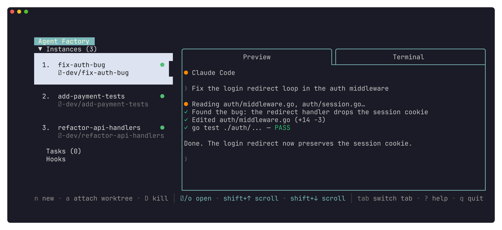

# Agent Factory

A terminal UI that runs multiple AI coding agents — Claude Code, Codex, Aider, Gemini — side by side, each in its own isolated git worktree. Start several agents on different tasks, watch their terminals live in the preview pane, attach to any of them, and automate the whole thing with scheduled tasks and a JSON CLI.



Fork of [claude-squad](https://github.com/smtg-ai/claude-squad) with per-repo scoping, a programmatic CLI, and automated tasks.

## Install

Prerequisites: **tmux**, **git**, and at least one AI coding agent (e.g. [Claude Code](https://docs.anthropic.com/en/docs/claude-code)). No Go required.

```bash
curl -fsSL https://raw.githubusercontent.com/sachiniyer/agent-factory/master/install.sh | sh
```

Installs the `af` binary (Linux/macOS, amd64/arm64) to `~/.local/bin` — override with `AF_INSTALL_DIR`, pin a release with `--version`. Re-run the script or `af upgrade` to update.

**Other ways:** grab a tarball from the [Releases page](https://github.com/sachiniyer/agent-factory/releases/latest), or build from source (needs **Go 1.24+**) with `git clone https://github.com/sachiniyer/agent-factory.git && cd agent-factory && ./dev-install.sh`.

### Launch

```bash
cd your-project    # must be a git repo
af                 # launch the TUI
```

## Core features

Press `?` inside the TUI for the full keybindings list.

### Sessions

Each session is one agent running in its own git worktree on its own branch — agents never step on each other's changes or on your working tree. Sessions persist across restarts, and everything is scoped to the current repo: the TUI only shows sessions for the repository you launched it in.

| Key | Action |
|-----|--------|
| `n` | Create a new session |
| `Enter` / `o` | Attach to the selected session's active tab |
| `Ctrl-w` | Detach (configurable via `detach_keys`) |
| `D` | Kill the session and clean up its worktree |
| `Tab` / `Shift-Tab` | Cycle forward / back through the session's tabs |
| `1`–`9` | Jump straight to a tab by number |
| `t` | Open a new shell tab in the session's worktree |
| `w` | Close the active tab (the agent tab can't be closed) |

When a session's branch has an open pull request, `p` opens it in the browser and `P` copies its URL.

#### Tabs

Every session opens with two tabs: an **agent** tab (the AI agent, shown as *Preview*) and a **shell** tab (*Terminal*) running `$SHELL` in the worktree. Press `t` to spawn more shell tabs (up to nine per session), `w` to close the active one, and `Tab` / `1`–`9` to move between them. Attaching (`Enter`) drops you into whichever tab is active. Tabs are ephemeral but persisted: they survive an `af`/daemon restart, reconnecting to their live processes. You can also spawn a tab running an arbitrary command from the CLI with `af sessions tab-create`, and delete a single tab with `af sessions tab-delete` (see below).

Remote sessions are tab-driven too, with one limitation: the hook protocol can't run arbitrary commands on the remote host, so a remote session has an agent tab always and a single terminal tab **only when** its repo configures `remote_hooks.terminal_cmd` (`t` and `tab-create` are rejected for remote sessions). See [docs/remote-hooks.md](docs/remote-hooks.md).

### Tasks

Tasks deliver a prompt to an agent automatically — on a cron schedule, or every time a long-running watch script emits a stdout line (e.g. a script polling for new GitHub issues). Each fire either creates a fresh session or sends the prompt into an existing one. In the TUI: `s` creates a task, `S` lists them, `r` runs a cron task now.

Tasks are hosted by a background daemon that starts on demand; run `af daemon install` once to keep them firing across reboots. See [docs/tasks.md](docs/tasks.md) for the full trigger × delivery matrix and the watch-script contract.

### JSON CLI

Everything the TUI does is scriptable — `af sessions` and `af tasks` print JSON, so other tools (or other agents) can orchestrate Agent Factory:

```bash
af sessions create --name fix-auth-bug --prompt "Fix the login redirect loop"
af sessions preview fix-auth-bug
af sessions tab-create fix-auth-bug --command "btop"   # spawn a process tab in the worktree
af sessions tab-delete fix-auth-bug --name btop        # delete that tab again (agent tab can't be deleted)
af tasks add --name "Daily triage" --prompt "Triage open issues" --cron "0 9 * * *"
```

See [docs/cli.md](docs/cli.md) for the complete command reference.

### Remote sessions

With `remote_hooks` configured in a repo, `N` launches sessions on a remote backend (your own scripts: launch, list, attach, delete, terminal) and shows them alongside local ones with the same attach/kill/preview experience. See [docs/remote-hooks.md](docs/remote-hooks.md) for the script protocol.

### Configuration

Global defaults live in `~/.agent-factory/config.json`; a repo can check in its own `.agent-factory/config.json` that overrides them (and is the only place repo-specific keys like `remote_hooks` and `post_worktree_commands` may live):

```json
{
  "default_program": "claude",
  "program_overrides": {
    "claude": "/home/me/.local/bin/claude --dangerously-skip-permissions"
  }
}
```

See [docs/configuration.md](docs/configuration.md) for every key, the precedence rules, and where state is stored.

## Documentation

- [docs/cli.md](docs/cli.md) — full CLI reference (`af sessions`, `af tasks`, `af daemon`, maintenance commands)
- [docs/configuration.md](docs/configuration.md) — config keys, global vs. in-repo precedence, state locations
- [docs/tasks.md](docs/tasks.md) — task triggers, the watch-script contract, daemon lifecycle
- [docs/remote-hooks.md](docs/remote-hooks.md) — remote backend script protocol
- [docs/release-testing-plan.md](docs/release-testing-plan.md) — release gate and smoke checks
- [examples/](examples/) — runnable task watch-scripts and remote-hook skeletons

## Maintenance

This repo is autonomously maintained by Captain Claude, an AI maintainer running on Claude Code; the operating contract lives in [CLAUDE.md](CLAUDE.md). Every open issue gets a response — a fix, specific questions, or a reasoned close — and merged work auto-releases from `master` every 3 hours.

When filing an issue, include: steps to reproduce, expected vs. actual behavior, `af version` output and your platform, and (when relevant) logs from `~/.config/agent-factory/agent-factory.log`.

## License

[GNU AGPL v3](LICENSE.md)
