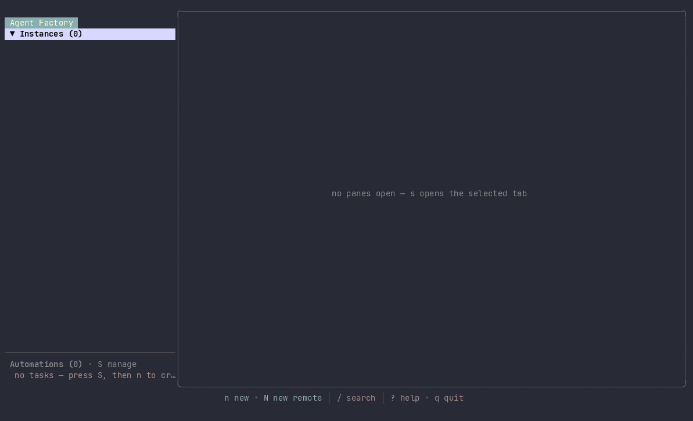

# Agent Factory

[](https://github.com/sachiniyer/agent-factory/releases/latest)
[](https://sachiniyer.github.io/agent-factory/)
[](LICENSE.md)

**Run a fleet of AI coding agents at once — each in its own git worktree, all on one screen.**

[](docs/assets/demo.mp4)

**Demo video:** [MP4](docs/assets/demo.mp4) · [WebM](docs/assets/demo.webm) · [GIF fallback](docs/assets/demo.gif)

Agent Factory (`af`) supervises Claude Code, Codex, Aider, Gemini, and Amp. Each
session gets a dedicated branch and worktree, so agents never trample the same
checkout.

One agent in one terminal is easy. Several is not — they collide in the same
checkout, you lose track of which is working and which is stuck waiting on you,
and there is nowhere to look that shows all of them. Agent Factory gives every
agent an isolated branch you review like any other, keeps it alive under a
background daemon, and puts the whole fleet on one screen — in your terminal or
in a browser.

**Full docs:** [sachiniyer.github.io/agent-factory](https://sachiniyer.github.io/agent-factory/)

## Install

Prerequisites: **tmux**, **git**, and at least one agent CLI on your `PATH`. No
Go toolchain needed for the prebuilt path.

```bash
curl -fsSL https://raw.githubusercontent.com/sachiniyer/agent-factory/master/install.sh | sh
```

That puts `af` in `~/.local/bin` (override with `AF_INSTALL_DIR`, pin with
`--version`). Or build from source with Go 1.25+:

```bash
git clone https://github.com/sachiniyer/agent-factory.git
cd agent-factory
./dev-install.sh
```

## Quickstart

```bash
cd your-project     # any git repo
af doctor --setup   # verify tmux, git, agent CLIs, storage, daemon health
af                  # open the TUI
```

Press `n` to start a session and describe the task — the agent goes to work in a
fresh worktree. `Enter` interacts with the selected session, `Ctrl-]` steps back
out, `o` attaches full-screen and `Ctrl-w` detaches. `?` lists every key, and
`af keys` prints the effective bindings.

Now open **<http://localhost:8443>** — the same sessions, live, in a browser. The
daemon serves the web UI on loopback by default: no token, no login screen.

## The mental model

Three ideas carry the whole tool.

- **Session — one agent, one worktree.** Creating a session cuts a branch and a
  git worktree, then launches your agent inside it. The branch stays an ordinary
  git artifact you can diff, push, or open a PR from. Pass `--here` when you
  deliberately want the agent in your current checkout instead.
- **Tabs — more than one thing per session.** Every session has its agent tab,
  and a local session can open more beside it in the same worktree: a shell with
  `t`, or — via `af sessions tab-create` — a long-running command, a web view, or
  a VS Code editor. Sessions on the docker, ssh, and hook backends run off-box,
  so their tab list is fixed by the runtime; adding tabs to them isn't supported
  yet.
- **Daemon — the thing that actually owns state.** A background daemon runs the
  sessions, schedules tasks, serves the web UI, and is the single source of
  truth. Opening the TUI starts one, as do autoyes mode and any enabled task;
  read-only commands like `af config list` and `af tasks list` leave it down. The
  TUI, the browser, and the CLI are all thin clients reading the same state, so
  they never disagree.

## Three ways to drive it

- **TUI** — `af` in a git repo. The default: a live rail of every session, with
  in-place interaction and full-screen attach.
- **Web** — <http://localhost:8443>. The same sessions, tabs, projects, and tasks
  in a browser, with real terminals. Bundled into the daemon and on by default.
- **CLI** — `af sessions` and `af tasks` emit JSON, so scripts and other agents
  can drive everything the TUI does.

```bash
af sessions create --name fix-auth --prompt "Fix the login redirect loop"
af sessions preview fix-auth
af sessions watch fix-auth      # block until it goes idle
af tasks add --name triage --prompt "Triage open issues" --cron "0 9 * * *"
```

## Highlights

- **Web tabs** — give a session a browser view: `af sessions tab-create demo
  --kind web --port 3000`. The daemon reverse-proxies loopback targets, so an
  agent's dev server is visible even when you view the web UI over Tailscale or
  SSH. Renders as an iframe in the web UI; the TUI shows a placeholder.
- **VS Code tab** — `--kind vscode` opens a `code-server` editor rooted at the
  session's worktree, one per session, viewed in the web UI. Requires
  `code-server` (or `openvscode-server`) on your `PATH`; `af` does not bundle
  either.
- **Tasks** — run a prompt on a cron schedule, or on every stdout line of a
  long-running watch command. Each run can create a fresh session or deliver into
  an existing one. See [tasks](docs/tasks.md).
- **Backends** — sessions run locally by default. Set a repo's `backend` key to
  `docker` to run in a container (with `docker.image`), to `ssh` to run on
  another machine (with `ssh.host`), or to `hook` to launch on your own
  infrastructure. See [backends](docs/backends.md).
- **Auto-update** — `af` updates itself on launch, at most once every 6 hours,
  and relaunches into the new build. Pin it with `auto_update = false`; track
  early builds with `update_channel = "preview"`. `af upgrade` updates on demand.

## Configuration

TOML. Global defaults in `~/.agent-factory/config.toml`; per-repo settings in
`.agent-factory/config.toml` inside the repository.

```toml
default_program = "claude"
worktree_root = "sibling"

[program_overrides]
claude = "/home/me/.local/bin/claude --dangerously-skip-permissions"
```

## Platform support

Linux and macOS are supported; Windows works through WSL2 (keep repos on the
Linux filesystem). Native Windows is not a target. tmux is required everywhere.
A fresh install has no autostart unit — run `af daemon install` to register one
(a systemd user service on Linux, a launchd agent on macOS) so the daemon starts
at login and task schedules keep running across reboots. Both are user-level
units, so they cover login and reboot, not running while you are logged out.
`af daemon status` reports whether one is installed.

## Documentation

- [Getting started](docs/getting-started.md) · [Why Agent Factory](docs/why-agent-factory.md) · [How it works](docs/how-it-works.md)
- Concepts: [sessions & worktrees](docs/concepts/worktree-agents.md) ·
  [the TUI](docs/concepts/tui.md) · [the web client](docs/web.md) ·
  [the daemon](docs/concepts/daemon.md)
- Guides: [CLI](docs/cli.md) · [configuration](docs/configuration.md) ·
  [tasks](docs/tasks.md) · [backends](docs/backends.md) ·
  [remote hooks](docs/remote-hooks.md) ·
  [remote daemon access](docs/remote-http-auth.md) ·
  [usage limits](docs/usage-limits.md)
- Reference: [HTTP API](docs/http-api.md) · [CLI reference](docs/reference/cli.md) ·
  [API reference](docs/reference/api.md)
- [Comparison](docs/comparison.md) with tmux, manual worktrees, and peers.

## Exposing it beyond localhost

The web UI and HTTP API listen on `127.0.0.1:8443` and skip auth on loopback.
Pointing `listen_addr` at a routable address exposes them to your network, so
set `require_token = true` or keep it behind a VPN or proxy — the listener is
plain HTTP. Turn the web UI off entirely with `listen_addr = ""`. See
[remote daemon access](docs/remote-http-auth.md).

## Maintenance

This repo is autonomously maintained by Captain Claude, an AI maintainer running
on Claude Code. The operating contract lives in [CLAUDE.md](CLAUDE.md).

Filing an issue: include repro steps, expected vs. actual, `af version`, and your
platform. `af bug-report` bundles versions, daemon health, tasks, redacted
session state, and recent logs into one file.

Agent Factory began as a fork of
[claude-squad](https://github.com/smtg-ai/claude-squad) and has diverged
substantially since.

## License

[GNU AGPL v3](LICENSE.md)
