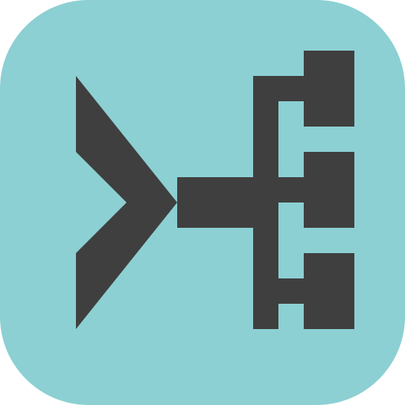
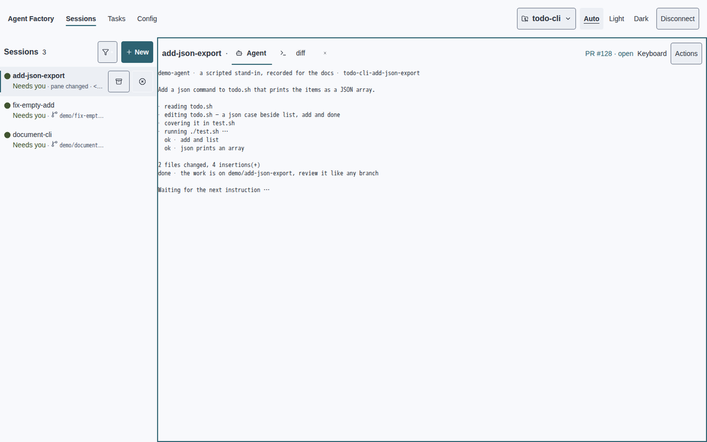

<p align="center">
  
</p>

<h1 align="center">Agent Factory</h1>

<p align="center"><strong>Run a fleet of AI coding agents at once — isolated workspaces, one control plane.</strong></p>

<p align="center">
  <a href="docs/assets/web/demo.mp4"></a>
</p>

<p align="center">
  <a href="https://github.com/sachiniyer/agent-factory/releases/latest"></a>
  <a href="https://sachiniyer.github.io/agent-factory/"></a>
  <a href="LICENSE.md"></a>
</p>

<p align="center">
  <a href="https://sachiniyer.github.io/agent-factory/">Docs</a> ·
  Web demo: <a href="docs/assets/web/demo.mp4">MP4</a> · <a href="docs/assets/web/demo.webm">WebM</a> · <a href="docs/assets/web/demo.gif">GIF</a>
</p>

Agent Factory (`af`) runs many AI coding agents — Claude Code, Codex, Aider,
Gemini, Amp, opencode, and Devin — and gives each one its own git branch and git
worktree, so parallel agents never share a checkout and every result comes back
as a branch you review like any other. You drive the whole fleet from a browser,
a terminal UI, or a JSON CLI, and all three read the same state. That state
belongs to a background daemon, which keeps sessions running when you close the
window, schedules recurring work, and serves the web client.

## Install

Prerequisites: **tmux**, **git**, and at least one agent CLI on your `PATH`, on
Linux, macOS, or WSL2. No Go toolchain needed for the prebuilt path.

```bash
curl -fsSL https://raw.githubusercontent.com/sachiniyer/agent-factory/master/install.sh | sh
```

That puts `af` in `~/.local/bin` (override with `AF_INSTALL_DIR`, pin with
`--version <tag>`). If the installer reports that directory is not on your
`PATH`, run `export PATH="$HOME/.local/bin:$PATH"` and add the same line to your
shell profile for future terminals. Or build from source with Go 1.25+:

```bash
git clone https://github.com/sachiniyer/agent-factory.git
cd agent-factory
./dev-install.sh
```

## First five minutes

```bash
cd your-project     # any git repo
af doctor --setup   # check tmux, git, agent CLIs, storage, daemon health
af                  # open the TUI
```

A session is an agent in its own git worktree (an isolated checkout on a new
branch). In the terminal UI (TUI), press `n`, replace the suggested name, then
`shift+tab` to describe the work in **Initial prompt**. Press Tab to keep the
prompt, then Enter to create the session. Tab from the name opens the agent
picker if you need a different agent.

Dismiss **Session created** with Enter or Esc. Watch the Agent tab on the right;
`●` means ready/idle, not proof that the task succeeded. Press Enter to type to
the agent in place (Enter again if **Interactive pane** help appears), and
`ctrl+]` to return to navigation. Handle any remaining agent sign-in or trust
prompt in its pane before expecting work to start. When you are done, press `a`
and confirm with Enter to archive the session. A doctor warning that autostart
is not installed does not block this walkthrough.

Now open **<http://localhost:8443>**. The same sessions, live, in a browser: the
daemon serves the web client on loopback with no token and no login screen.
Use a browser on the machine running `af`, then select a session in the rail to
open its terminal. If the page does not load, run
`af daemon status` and check the `tcp listener` address and whether it is bound;
use that port if it differs from 8443. An empty `network.listen_addr` disables
the web listener. See [Web client](docs/web.md) for configuration and remote access.

## The mental model in five terms

- **Session** — one agent working on one task, with its own tabs and lifecycle.
- **Worktree** — the isolated checkout and branch a session gets, so agents
  never collide and the result is ordinary git work you can diff and merge.
- **Daemon** — the background process that owns all state, keeps sessions alive
  across restarts, and serves the web client; every surface is a thin client.
- **Task** — a prompt the daemon delivers on its own, on a cron schedule or on
  each line a watch command prints.
- **Account** — a named credential home for an agent, so a session can be pinned
  to a specific Claude, Codex, or Gemini login instead of your default one.

Each of those is one page in [Concepts](docs/concepts.md).

## Three surfaces, one daemon

- **Web** — <http://localhost:8443>: sessions, real terminals, tabs, tasks, and
  config in a browser. Bundled into the daemon and on by default. →
  [Web client](docs/web.md)
- **TUI** — `af` in a git repo: a dense rail of every session, with in-place
  interaction and full-screen attach. → [TUI](docs/tui.md)
- **CLI** — `af sessions` and `af tasks` emit JSON, so scripts and other agents
  can create, prompt, watch, and archive sessions. → [CLI](docs/cli.md)

```bash
af sessions create --name fix-auth --prompt "Fix the login redirect loop"
af sessions watch fix-auth      # block until it goes idle
af tasks add --name triage --prompt "Triage open issues" --cron "0 9 * * *"
```

## Beyond your laptop

Sessions can run in a container, on another machine over SSH, or on
infrastructure you provision yourself, and the daemon itself can be reached from
a second machine. → [Backends and remote access](docs/backends.md)

## Documentation

Full docs: **<https://sachiniyer.github.io/agent-factory/>** — a **Use** section
(getting started, concepts, the three surfaces, tasks, accounts, backends,
configuration, troubleshooting) and a **Develop and maintain** section. Start at
[Getting started](docs/getting-started.md), or
[Troubleshooting](docs/troubleshooting.md) when something looks wrong.

## Maintenance

This repo is autonomously maintained by Captain Claude, an AI maintainer on
Claude Code; the operating contract lives in [CLAUDE.md](CLAUDE.md).

Filing an issue: include repro steps, expected vs. actual, `af version`, and your
platform — `af bug-report` bundles all of that into one redacted file. Agent
Factory began as a fork of [claude-squad](https://github.com/smtg-ai/claude-squad).

## License

[GNU AGPL v3](LICENSE.md)
