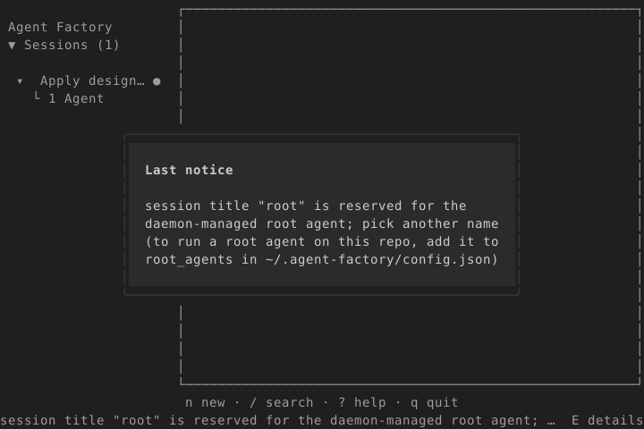
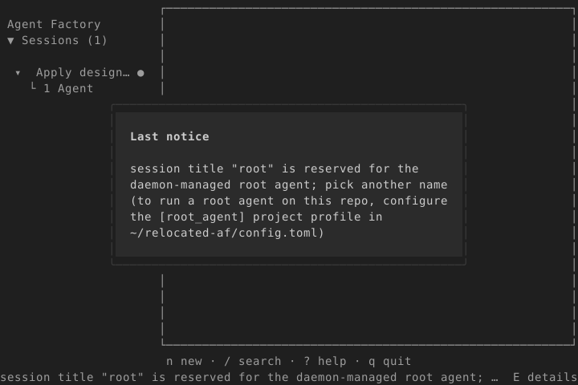

# Historical config remedy evidence (#4069)

The after frame records the intermediate global-file remedy at `b768f02e8`.
Codex finding [3957456432](https://github.com/sachiniyer/agent-factory/pull/4073#discussion_r3957456432)
superseded that advice: the current remedy registers this repository and sets its
personal `[root_agent]` profile using `af config set --project .`. These frames
are historical, not screenshots of the final remedy. The review correction is
covered by `TestReservedTitleRefusalProjectScopedRemedy`; recapture was deferred
under the maintainer's explicit no-container instruction during high host load.

These 80×24 dark-mode frames were rendered by the app's design-scene harness
inside `scripts/testbox.sh`, with its pinned clock. “Last notice” is open so the
complete remedy is visible. The before fixture uses the exact reserved-title
message from the base revision; the after fixture calls `ReservedTitleRefusal`.
Both use `HOME=/home/operator` and `AGENT_FACTORY_HOME=/home/operator/relocated-af`.

| Before #4069 | Intermediate remedy (superseded) |
| --- | --- |
|  |  |

The ANSI frames and temporary capture source are included for reproduction.
Copy `capture_test.go.txt` to `app/config_remedy_capture_test.go`, then run only
in the container, after the load gate permits it:

```sh
scripts/testbox.sh test ./app -run 'TestConfigRemedyCapture$' -count=1 -v
```

The test logs base64 SVG/ANSI payloads in before/after order. Remove the temporary
test afterward. No `app/testdata/design` golden was changed.
