# Dark Modern theme evidence

Issue [#3971](https://github.com/sachiniyer/agent-factory/issues/3971) changes the
dark twin to near-black surfaces and grey ink. The light twin and all six state
colours remain unchanged. See the generated [palette and contrast measurements](../../../design/interface-design.md#fixed-colour-and-liveness-contract).

## Provenance

Before images are unmodified committed captures from base master
`1d63ad3e58d11e131d44b5b160f054301a3ea4cb`. Phone captures are the final #3968
evidence already on that base. After images use this branch's rebuilt client,
the same container recorder and seeded stand-in transcript. TUI PNGs are browser
renders of the app-model driver's SVGs, generated in the playtest container;
they show deterministic fixtures rather than live agent output.

The public TUI video is separately recorded with real Codex sessions in the
throwaway playtest sandbox, using the existing credential-aware recorder.

## Before and after in dark

| Screen | Before | After |
| --- | --- | --- |
| Dashboard | 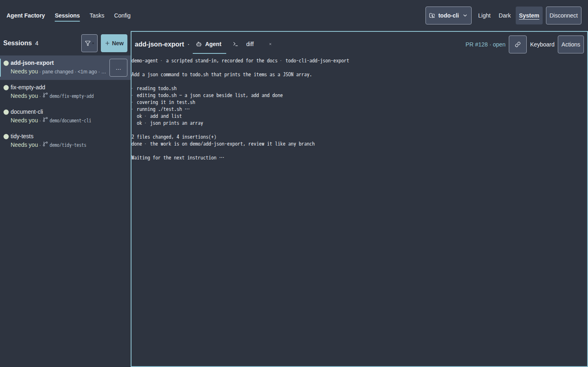 | 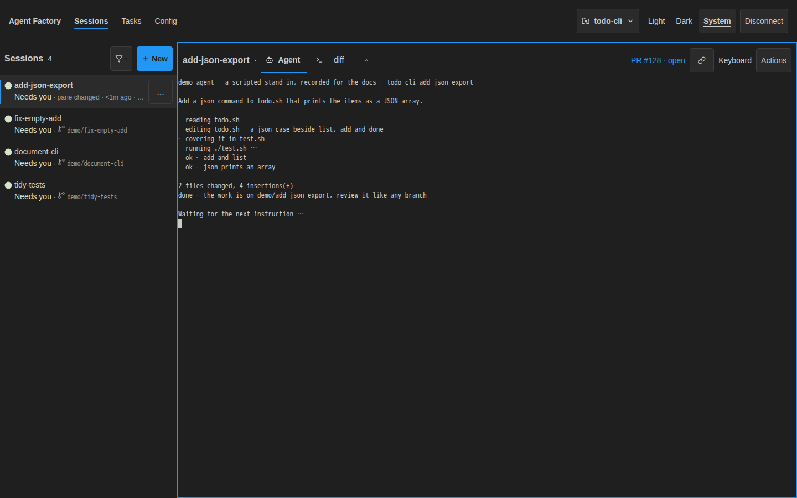 |
| New session | 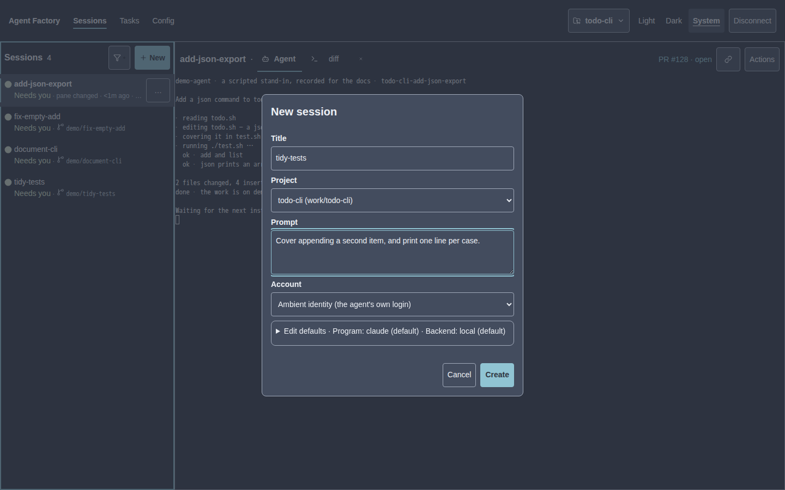 | 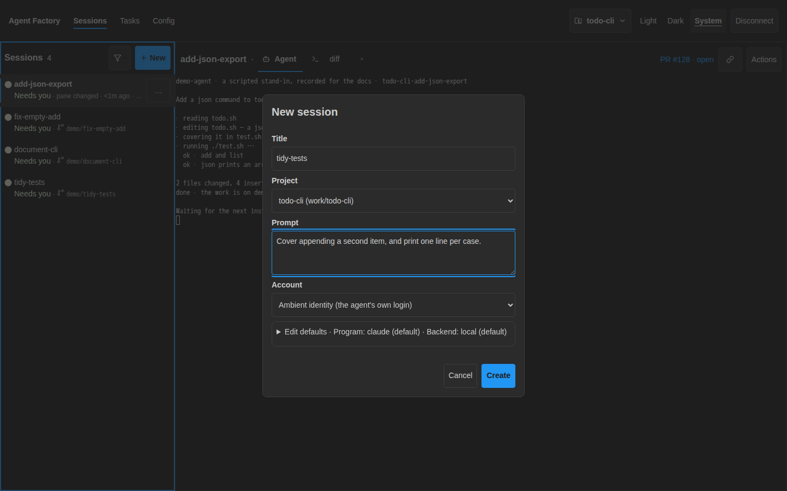 |
| Phone 360px | 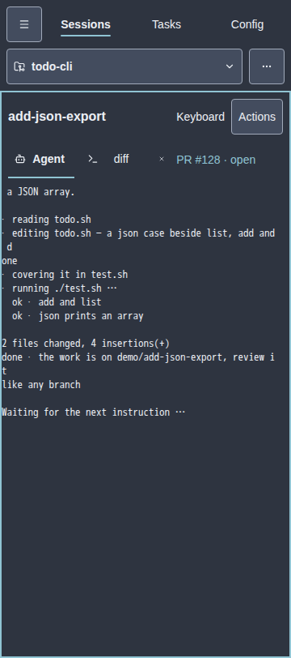 | 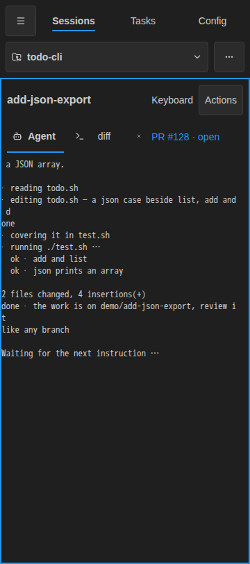 |
| Phone 390px | 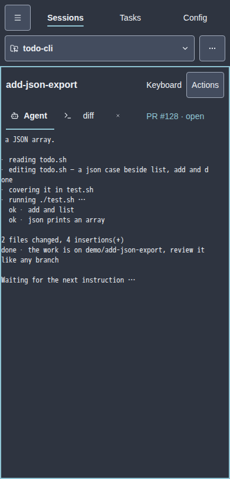 | 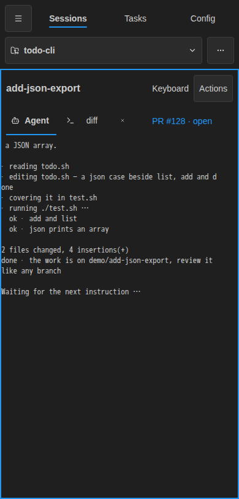 |
| Phone 430px | 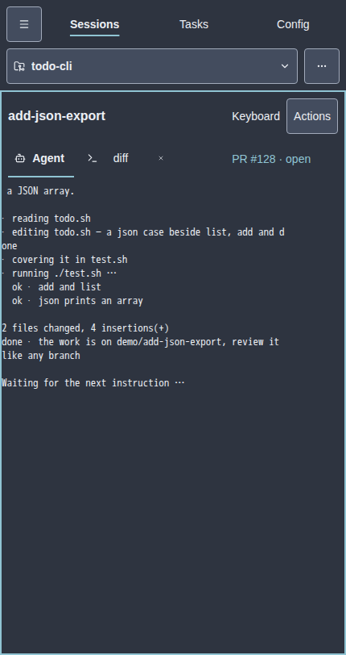 | 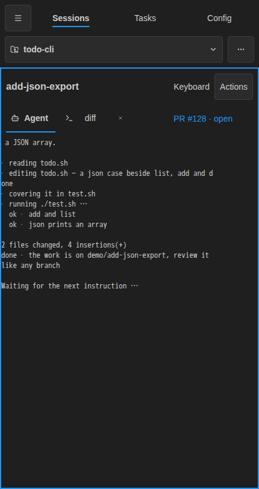 |
| TUI sessions | 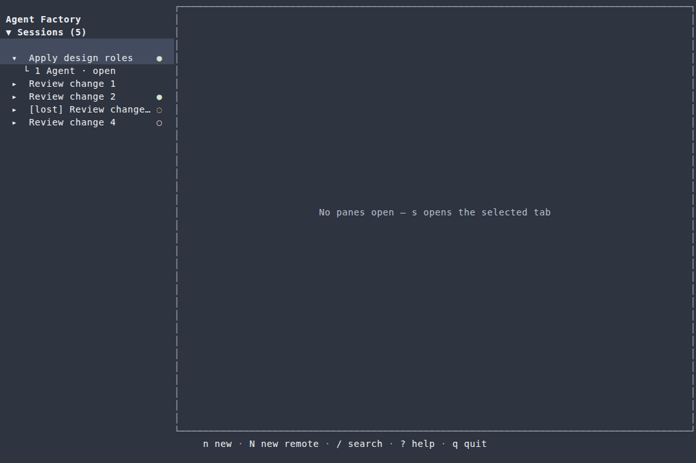 | 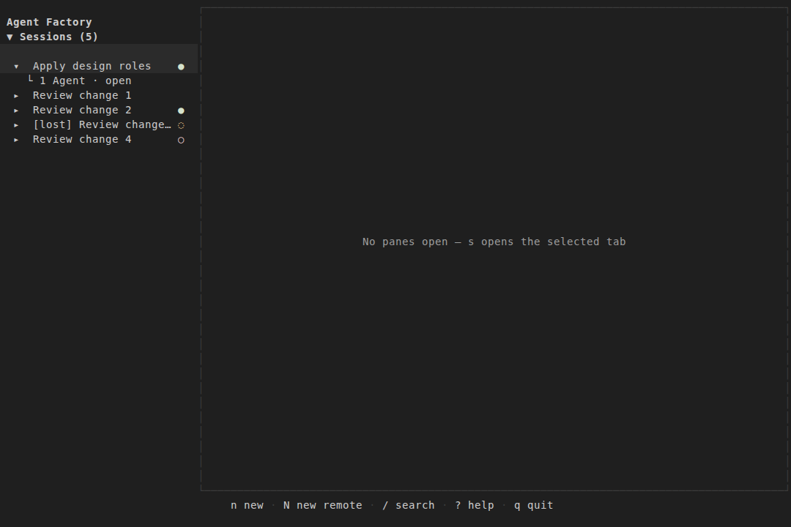 |
| TUI Config appearance | 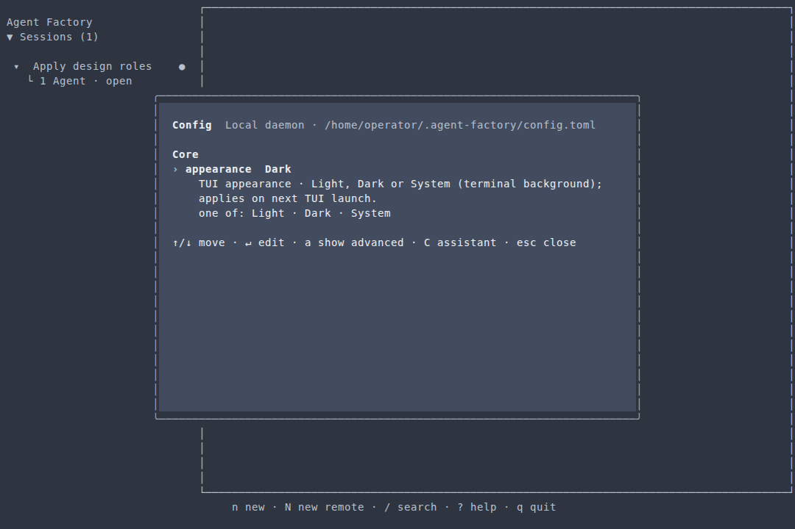 | 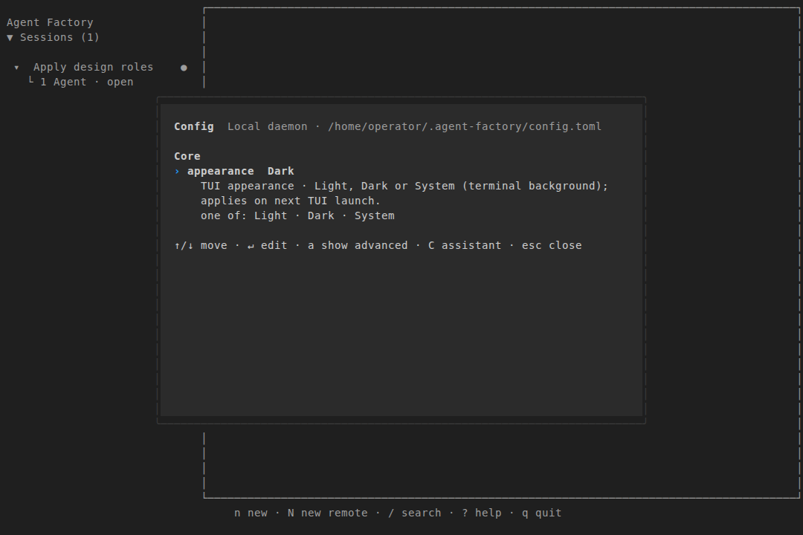 |

## Live TUI play-test

Built the current source in `af-playtest-3971-theme`, created by the repository's
playtest-container harness. Set `appearance dark`, launched with true-colour
output at 120 × 36, then opened the Initial prompt dialog, Config and `?` help.

- [Rail text](live/rail.txt): Agent Factory, Sessions (0), No sessions yet and the create action.
- [Dialog text](live/dialog.txt): Initial prompt, multiline field, done and cancel hints.
- [Config text](live/config.txt): Config, Core and editable configuration rows.
- [Help text](live/help.txt): version heading, paging, close route and session operations.
- [Help ANSI](live/help.ansi): emitted colour evidence from the live tmux pane.

The rail uses near-black surface, overlays use raised surface, and grey text
remains readable. Text captures describe content; the paired PNGs and ANSI
capture supply colour evidence. The help wait initially expected a literal
“Help” heading; this screen uses a version heading. Matching its visible
“toggles help” instruction confirmed the same open overlay.

No app/daemon test or TUI ran on the host.

## Verification and page weight

732 web unit tests, typecheck, Go build/vet/lint, changed-package container race
tests, TUI golden comparison and 32 web recovery/session-link tests pass.
The visual recorder checks dark phone widths 360, 390 and 430.
All performance and media budgets remain unchanged.

| Built page | Images before | Images after | Change | HTML + images before | HTML + images after |
| --- | ---: | ---: | ---: | ---: | ---: |
| / | 3,729,059 | 3,752,213 | 23,154 | 3,790,210 | 3,813,658 |
| /web/ | 940,201 | 914,680 | -25,521 | 1,039,745 | 1,014,521 |
| /use-cases/ | 421,274 | 410,378 | -10,896 | 478,475 | 467,876 |
| /comparison/ | 165,648 | 160,684 | -4,964 | 231,479 | 226,812 |
| /getting-started/ | 977 | 977 | 0 | 59,018 | 59,315 |
| /tui/ | 59,793 | 56,859 | -2,934 | 113,882 | 111,245 |
| /design/style-guide/ | 1,539,099 | 1,496,482 | -42,617 | 1,625,756 | 1,583,530 |
| /design/recovery-stills/ | 1,166,232 | 1,147,440 | -18,792 | 1,211,482 | 1,192,990 |
| /design/tui-recovery-stills/ | 7,126,609 | 7,126,609 | 0 | 7,174,088 | 7,174,388 |
| /design/tui-design-a-stills/ | 27,441,561 | 27,441,561 | 0 | 27,504,807 | 27,505,107 |
| /design/tui-design-b-stills/ | 32,194,091 | 32,194,091 | 0 | 32,263,678 | 32,263,978 |
| /design/tui-design-c-stills/ | 33,422,223 | 33,422,223 | 0 | 33,491,629 | 33,491,929 |

Both sites were built with the pinned Docs toolchain. Counts sum unique local
image references (both themes) plus page HTML, excluding shared assets and
transfer compression. Video source bytes are separate:

| Media | Before bytes | After bytes |
| --- | ---: | ---: |
| WEB MP4 | 452,255 | 437,157 |
| WEB WEBM | 643,101 | 654,739 |
| WEB GIF | 3,728,082 | 3,751,236 |
| TUI MP4 | 423,021 | 468,968 |
| TUI WEBM | 370,028 | 378,253 |
| TUI GIF | 394,824 | 391,682 |
