# Phone terminal keybar · #3977

At phone widths (≤768px), the focused terminal has Ctrl, Alt, Esc, Tab and ^C
on the first row, with arrows on the second. At 360px, the five targets are
62.4px wide and 44px high: 360 − 16px insets − 32px gaps leaves 312px.
The two rows fit at all three widths without scrolling. Safe-area insets are
respected, and visual-viewport resize/scroll refits the terminal above the bar.

Ctrl and Alt are one-shot modifiers. Double tap within 350ms to lock, then tap
to release. Locked controls use the selected-row treatment, an accent outline
and a static ▸ marker. ^C sends an interrupt immediately. Pointerdown cancels
the browser's focus transfer so the soft keyboard stays open.

The before stills are the existing committed phone captures from the starting
master (`658f404f4745d1b4aba86a40e2e2c5f209a6724f`). The after stills use the same recorder's isolated daemon and scripted
stand-in agent at 812px height; these are real client screens, not mockups.
The browser test observes outgoing binary PTY Input frames for ^C, Ctrl then c
via input events without keydown, and Ctrl then composed c at each width in
both themes, and mixes physical and soft-keyboard input with Ctrl locked. It also checks target sizes, focus retention, hidden state on
keyboard handoff, and terminal fit after simulated visual viewport resize/scroll.
The recorder fixture repaints on SIGINT so each interrupt reaches the real PTY
without ending the subsequent capture scene. Browser emulation does not display
an actual OS soft keyboard.

| Width | Theme | Before | After |
| --- | --- | --- | --- |
| 360 | Light | 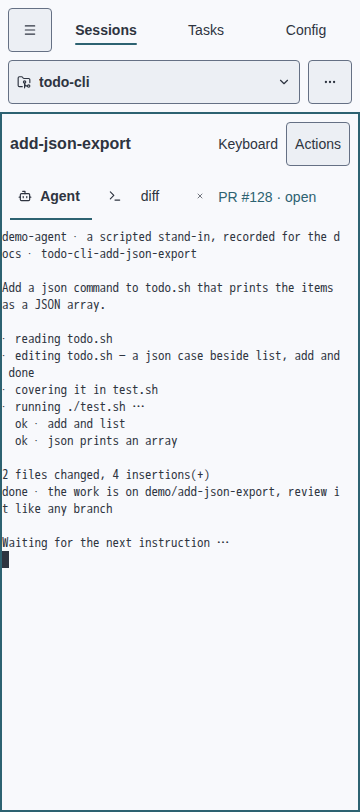 | 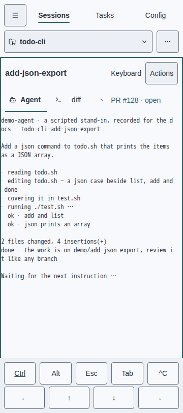 |
| 360 | Dark |  | 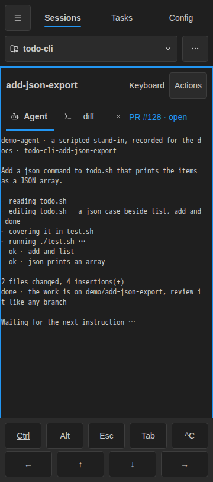 |
| 390 | Light |  | 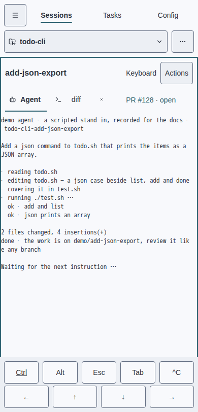 |
| 390 | Dark |  | 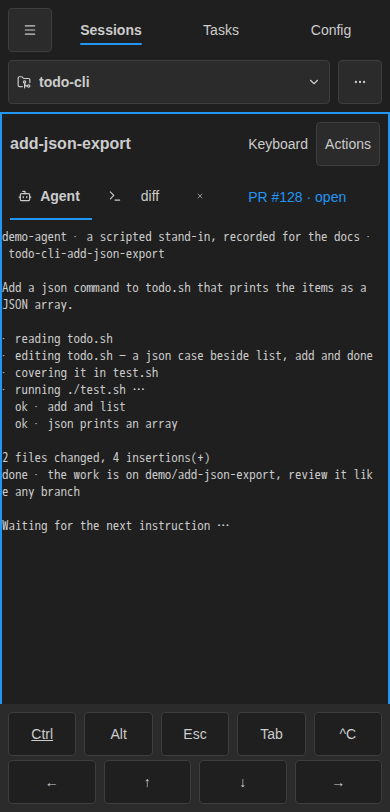 |
| 430 | Light | 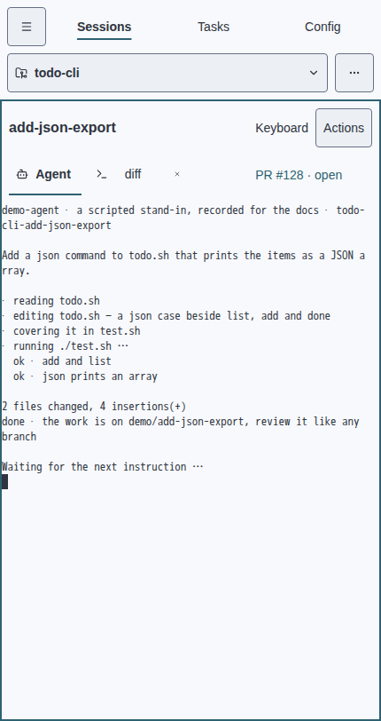 | 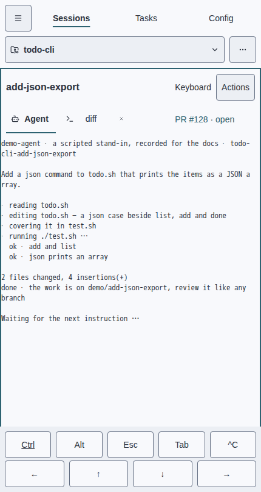 |
| 430 | Dark | 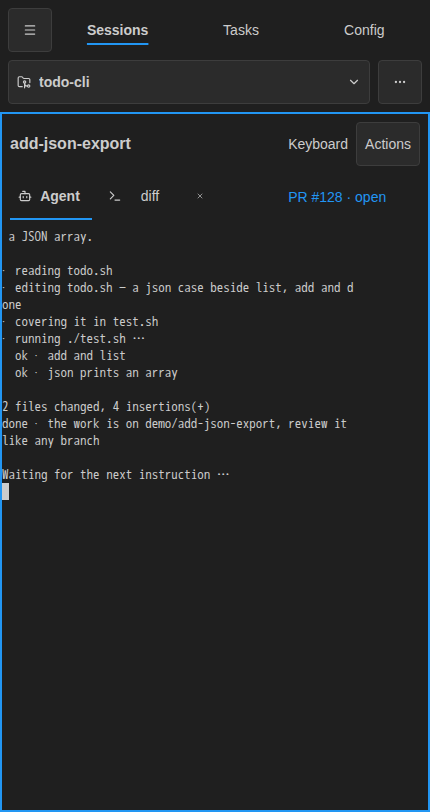 | 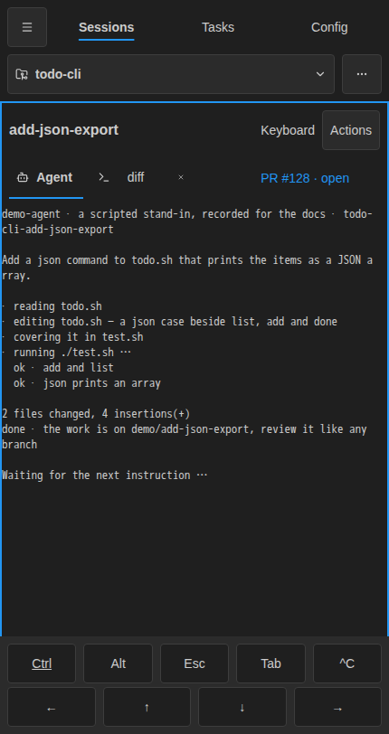 |

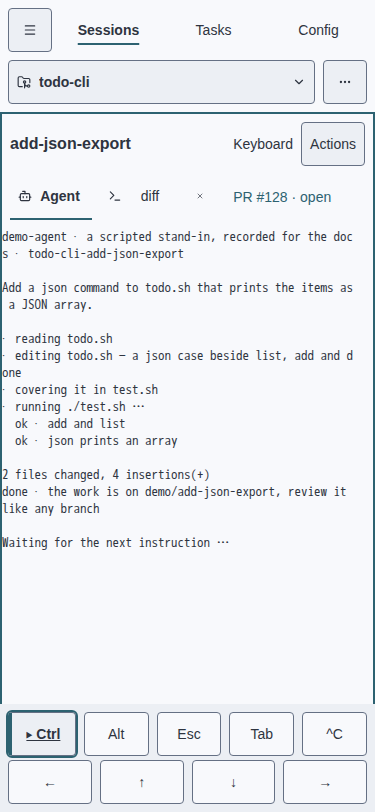
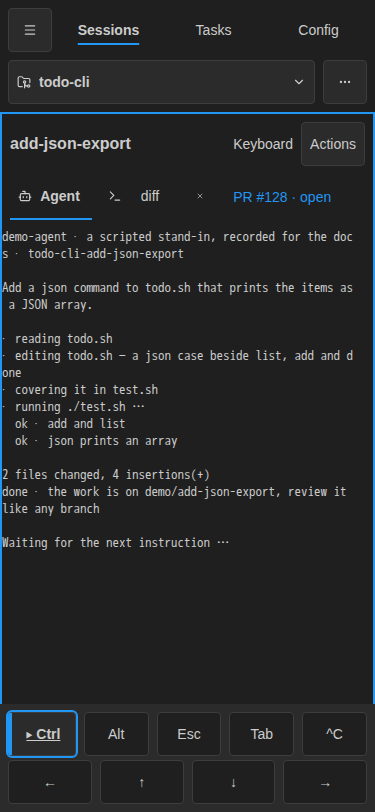

The tests were watched red first: the unit runner failed with the missing
keybar module, and the browser test failed waiting for the absent keybar in
the unchanged bundle. The implementation then passed the mapping and state
unit tests. See [unit red evidence](unit-red.txt) and [browser red evidence](browser-red.txt).

Sources: [keybar](https://github.com/sachiniyer/agent-factory/blob/master/web/src/terminal-keybar.ts),
[browser assertions](https://github.com/sachiniyer/agent-factory/blob/master/web/selftest/phone-keybar.ts),
[phone recorder](https://github.com/sachiniyer/agent-factory/blob/master/web/selftest/web-demo.spec.ts).

## Verification

All 737 web unit tests passed, along with typecheck and the tracked bundle
rebuild. The update run generated the phone goldens; after disabling the
fixture's control-key echo, `make perf-container` with updates disabled passed
all five visual scenarios, the three-sample browser measurements and every
unchanged performance budget. The six after captures were byte-for-byte
identical between the update and comparison runs. A subsequent unit-tested
ASCII guard prevents Unicode uppercase expansion from creating a Ctrl byte.

The exact Docs strict build passed with the dependencies in
[requirements-docs.txt](https://github.com/sachiniyer/agent-factory/blob/master/requirements-docs.txt).
`scripts/gen-docs.sh`, the design-token tests and the generated-design drift
check passed. No Go source changed.
