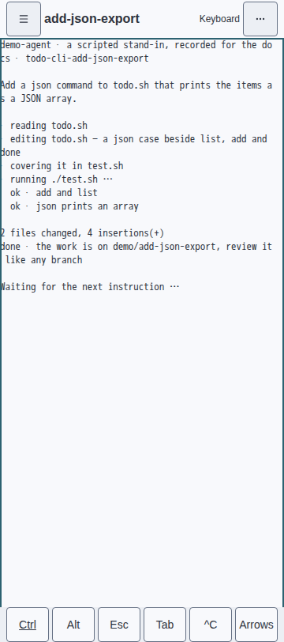
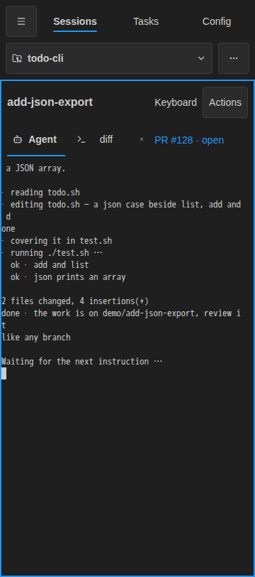
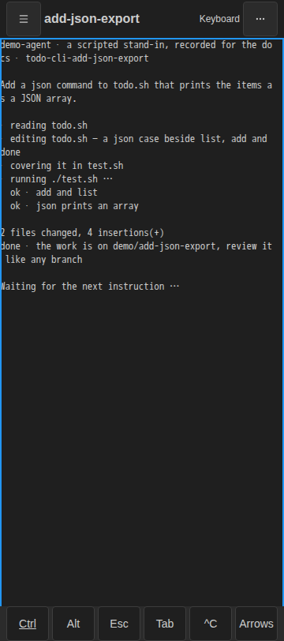
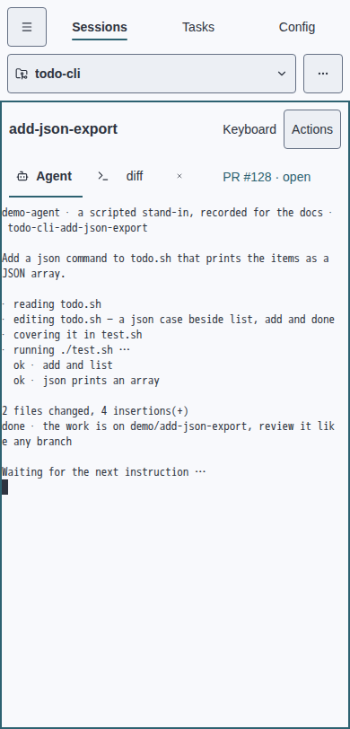
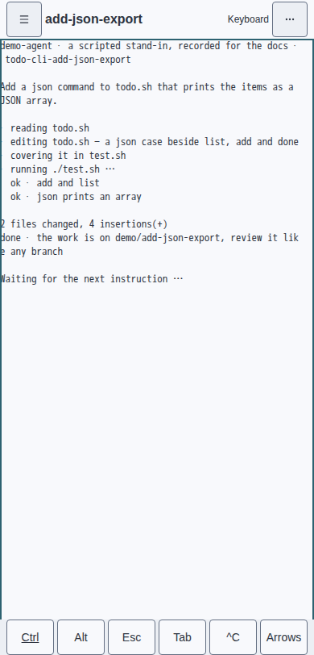
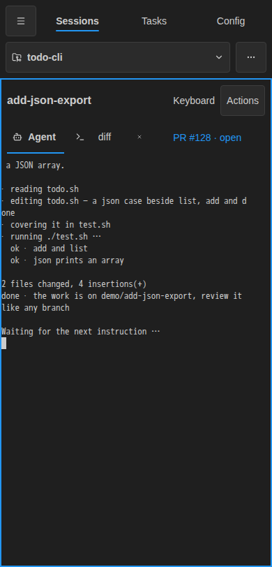
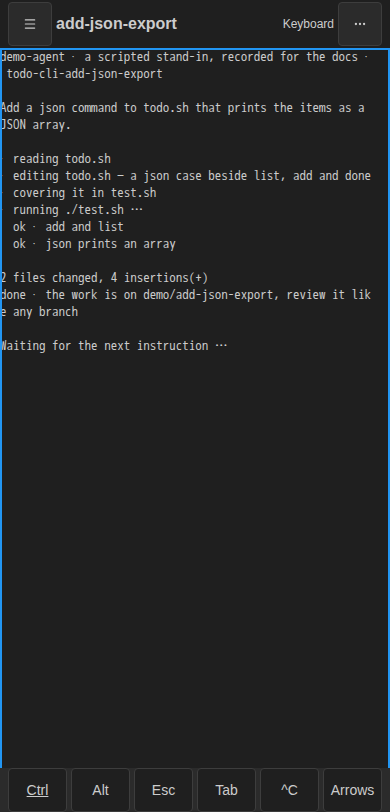
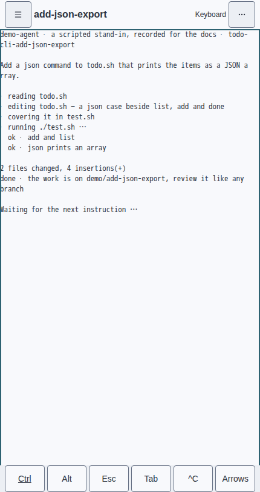
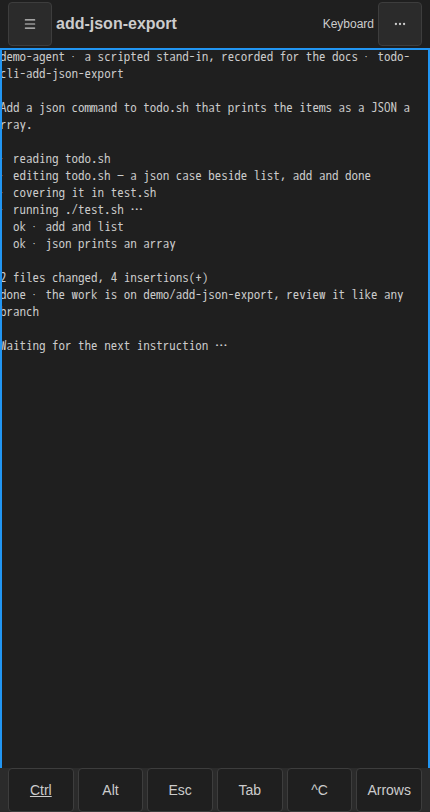

# Session-first phone layout · #3981

A selected terminal at ≤768px gets one 48px chrome row: drawer toggle, truncating
session title, static Keyboard state and one … disclosure. The disclosure keeps
project choices, Sessions · Tasks · Config, Light · Dark · System, Disconnect,
install, pane actions, new-tab choices and the tab switcher reachable. Escape
closes it and returns focus. Drawer, Tasks, Config and desktop layouts remain
available. Split sessions show the focused pane, with Close pane in the menu,
and restore both panes on desktop. The six-button primary keybar is one 44px row; Arrows replaces it with
Back and four arrow keys, preserving 44px targets and terminal focus.

## Measured height budget

Measurements use Chromium's visual viewport with the OS soft keyboard closed,
while the terminal owns keyboard input and the keybar is visible. Both themes
produce the same geometry. The terminal element is `.af-pane-host .xterm`.

| Width | Theme | Visual viewport | Top chrome | Keybar | Terminal | Terminal share |
| --- | --- | --- | --- | --- | --- | --- |
| 360px | Light | 812px | 48px | 44px | 720px | 88.7% |
| 360px | Dark | 812px | 48px | 44px | 720px | 88.7% |
| 390px | Light | 812px | 48px | 44px | 720px | 88.7% |
| 390px | Dark | 812px | 48px | 44px | 720px | 88.7% |
| 430px | Light | 812px | 48px | 44px | 720px | 88.7% |
| 430px | Dark | 812px | 48px | 44px | 720px | 88.7% |

The regression assertion requires at least 85% at all three widths in both
themes. The unchanged bundle failed at 360px with a 476px terminal (58.6%).
Browser emulation does not show an actual OS keyboard; the stream suite also
simulates visual viewport resize and pan to verify terminal fit above it.

## Before and after

Before stills are the committed recorder captures from starting master
`df215cfe` (after #3980 merged). After stills use the real client and isolated
daemon with the same scripted stand-in transcript, at 812px viewport height.
These are browser captures, not mockups.

| Width | Theme | Before | After |
| --- | --- | --- | --- |
| 360px | Light |  |  |
| 360px | Dark |  |  |
| 390px | Light |  |  |
| 390px | Dark |  |  |
| 430px | Light |  |  |
| 430px | Dark |  |  |

## Verification

The new composition and one-row keybar tests were watched fail against the
original sources: [unit red evidence](unit-red.txt). The browser budget failed
against the original tracked bundle: [browser red evidence](browser-red.txt).

The browser recorder checks one-row chrome, title truncation and full accessible
text, 44px targets, disclosure activation and Escape focus return, and the height
budget in both themes. The existing outgoing binary PTY Input assertions cover
interrupt, one-shot Ctrl, composed input, locked Ctrl, focus retention and
viewport changes; arrow selection additionally checks the outgoing arrow bytes.

Sources: [composition](https://github.com/sachiniyer/agent-factory/blob/master/web/src/components.ts),
[keybar](https://github.com/sachiniyer/agent-factory/blob/master/web/src/terminal-keybar.ts),
[browser assertions](https://github.com/sachiniyer/agent-factory/blob/master/web/selftest/web-demo.spec.ts).

All 740 web unit tests passed, with source and recorder typechecking and the
tracked bundle rebuilt. Eight focused browser regressions passed, including
real touch scrolling/copying/reordering, overflow navigation, drawer transitions
and split-pane restoration. The old drawer lifecycle test additionally assumes
an archived fixture from an earlier full-suite test; it is not self-contained
when selected alone.

`AF_UPDATE_GOLDENS=1 make perf-container` regenerated the goldens; comparison
without the flag passed all five visual scenarios and every unchanged performance
budget. Ten unrelated golden refreshes contain only 4–45 changed control-edge
pixels each. The pixel oracle and performance thresholds are unchanged.
`scripts/gen-docs.sh`, design-token tests, generated-design checking, file-length
lint and the Docs job's exact `mkdocs build --strict` passed. No Go source changed.
