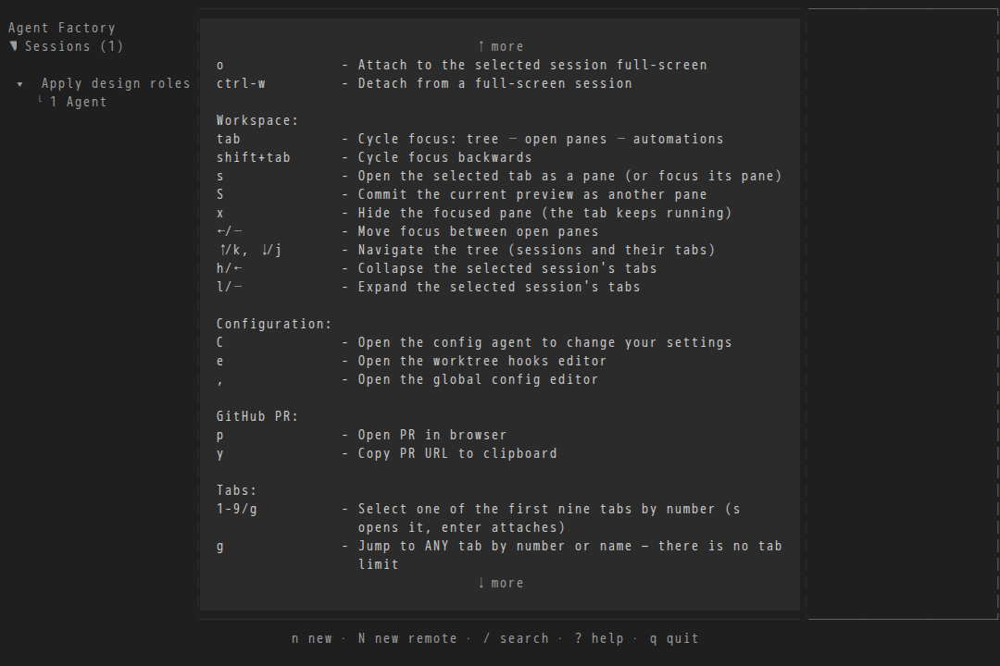
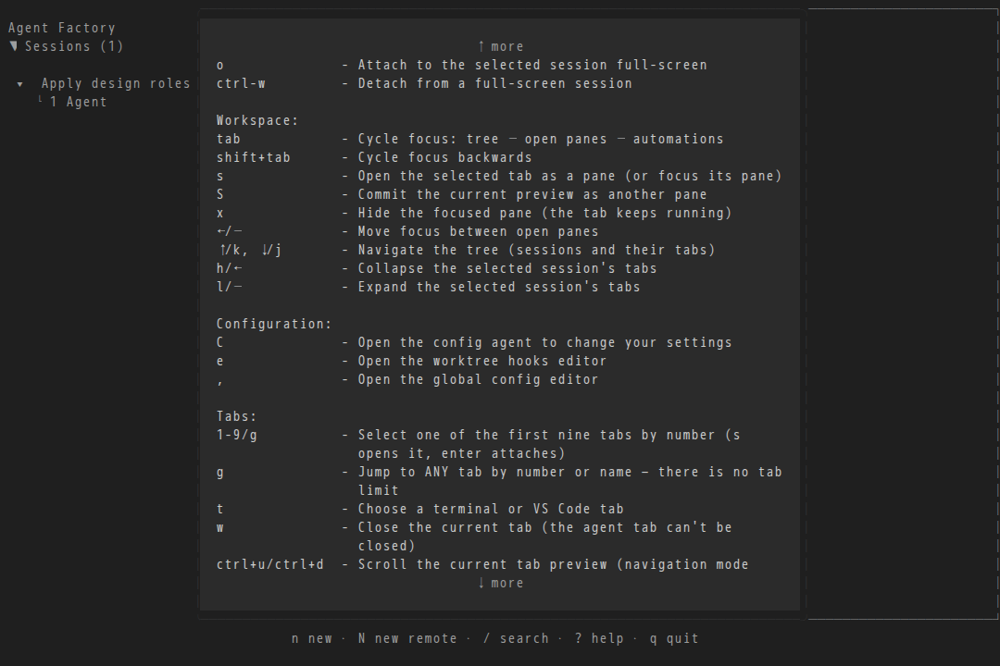
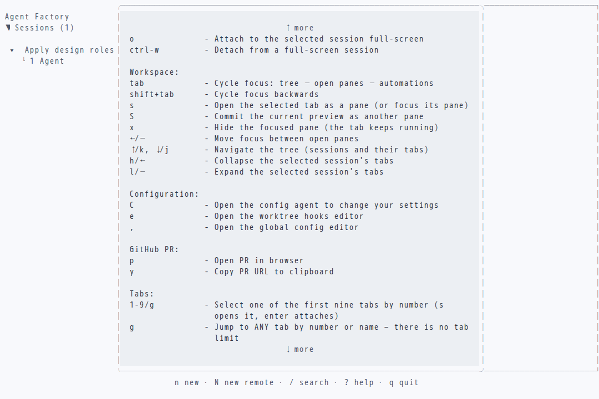
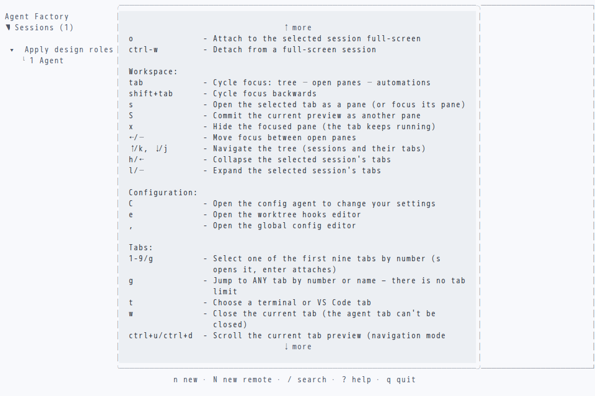

# Remove branch-associated PRs (#4016)

The pinned `TestDesignDriverScenes/help-actions` scene opens general help and
scrolls down 26 lines at 120×36. Captured in the testbox container with
`AF_TUI_DESIGN_CAPTURE=/tmp/capture`; Chromium in the web testbox rendered the
SVGs to PNGs. Both palettes were visually inspected.

The before capture runs base `e4e67cb294b70e215067e7410c4dbf3035f08b02`
with only the new scene added to its existing design harness. The after capture
runs this change.
Configuration now leads directly into Tabs; the GitHub PR heading and `p`/`y`
actions have disappeared. The after SVGs also live in `app/testdata/design/`
as deterministic golden fixtures. All existing design scenes were recaptured
in the container and remained byte-identical.

| | Before | After |
| --- | --- | --- |
| Dark |  |  |
| Light |  |  |

Capture command (inside the container, after copying the read-only source):

```sh
AF_TUI_DESIGN_CAPTURE=/tmp/capture go test -buildvcs=false ./app \
  -run 'TestDesignDriverScenes/help-actions' -count=1
```
