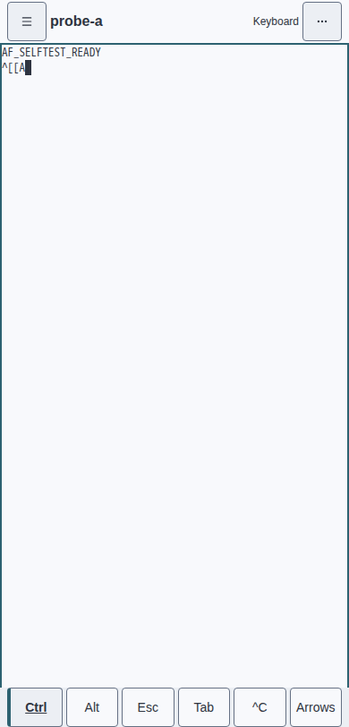
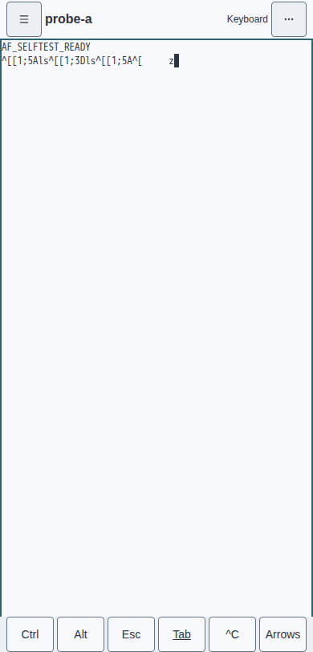
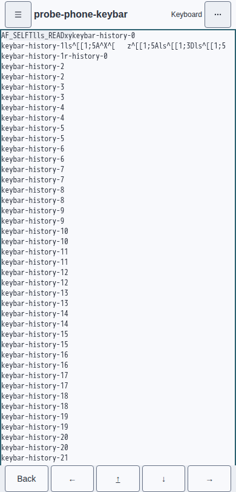
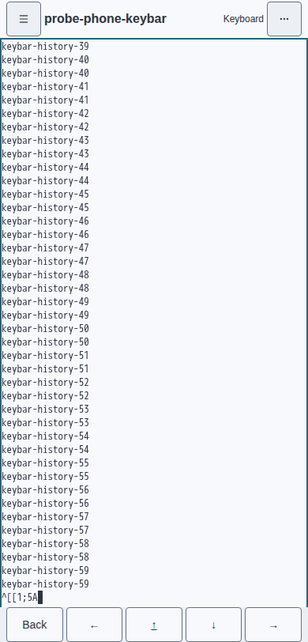

# Phone keybar modifiers · #4036

Container-captured phone design stills (390×812):

| Before | After |
| --- | --- |
|  |  |

The before still is master with the new browser regression: Ctrl → Arrows → Up
→ Back sends plain `ESC[A` and leaves Ctrl armed. The after still is the fixed
client after the focused modifier flow. The container uses its scripted test
agent; the displayed byte echo is not a real-agent interaction.

Reproduce the browser assertions and screenshots with:

```sh
AF_PLAYWRIGHT_ARGS='-g keybar' scripts/testbox.sh web-selftest
```

The browser observes actual outgoing binary Op.Input frames via the existing
`phoneInputStream` seam. Ctrl → Up → soft-keyboard `ls` must send exactly
`ESC[1;5Als`; Alt → Left → `ls` must send exactly `ESC[1;3Dls`.
Both one-shots clear their state and armed accessibility description.
The focused flow also verifies locked Ctrl + Up, one-shot Alt + Tab + `z`,
and one-shot Alt + hardware Escape followed by an unmodified `a`.
The demo’s existing full phone flow reuses these assertions and retains its
coverage of plain arrows, interrupt, composition, physical keypresses, focus,
and viewport resizing.

[Unit red](unit-red.txt) records the issue's two original tests failing against
master before implementation. The second reproduction now invokes the explicit
bar-key operation (`key("←")`) and expects the modified bytes; its original
`input(ESC[D)` call represents xterm emissions, which intentionally must not
consume modifiers. The existing terminal-reply preservation test remains intact.
[Unit green](unit-green.txt) records all 10 focused tests passing.
[Browser red](browser-red.txt) and [browser green](browser-green.txt) record the
same browser regression before and after the fix.

No Go TUI design golden changed.

## Refocus regression from the full perf lane

CI run 34174632552's trace shows the first (360px) phone pass completing, then
`Control+]` at 63594ms and textarea refocus at 63623ms. On the second (390px)
pass, Ctrl → Up clears Ctrl, but `keyboardInsertText("ls")` at 71080ms emits
nothing. The `[7m`/`[27m` in the failure message are Playwright's diff highlighting,
not bytes in the captured input. `phoneInputStream` only records outgoing
`Op.Input` frames, never PTY output.

Xterm 5 sets `_keyDownSeen` before invoking the custom shortcut handler. The
shortcut blurs the textarea, so xterm misses keyup and retains that flag. Its
native `_inputEvent` then discards composed `insertText` events. The keybar's
existing workaround intercepted only armed input; once the bar consumed the
modifier, the following plain letters fell through to that stale xterm state.

The fix applies the existing soft-input interception to plain text as well.
Physical-key and composition guards remain. The focused regression now repeats
all modifier gestures after `Control+]` and refocus, then verifies physical
letters are sent once. The shared helper also checks locked Ctrl + Up + soft
`x` yields `ESC[1;5A` + `0x18` and remains locked. Both the demo and probe use
these exact input assertions without synthesizing keyup or resetting xterm.

Validation after the refocus fix:

- Full `make perf-container`: [red](perf-red.txt), then [green](perf-green.txt).
  All five visual tests passed without golden updates; the three-run web/TUI
  measurements passed every budget.
- Focused container phone spec: [refocus red](refocus-red.txt), then
  [refocus green](refocus-green.txt), including the repeat after blur/refocus.
- `npm test`: 744/744; typecheck and rebuilt `web/dist` passed.
- gofmt, Go build/vet, fast lint, and file-length lint passed.

## Full-suite isolation and xterm user-input effects

The next full-suite run exposed a second interaction: the standalone phone spec
had been writing to shared `probe-a`. Its fake agent is `cat`; later Enter
submits the pending cursor sequences, which cat echoes as terminal commands.
Those commands overwrite `AF_SELFTEST_READY` with the phone test's `ls`/`xy`
letters. The #2337 scrollback assertion then fails, leaving its own history
behind for the shell/split/scroll/service-worker tests that follow. The local
full suite reproduced this cascade from head `61948022`.

The phone spec now creates and kills its own session in `try/finally`. This
retains the real daemon/PTY assertions without mutating shared fixture output.
The separate demo helper continues to use the demo's scripted terminal.

Codex thread 3952881077 also identified the direct PTY sink's missing xterm
side effects. Bar keys now resolve and consume sticky modifiers, then invoke
the same `term.input(data, true)` callback as soft input. The existing transform
preserves those complete escape/control byte strings, so locked modifiers are
not applied twice. There is no direct keybar-to-PTY callback anymore.

The new browser probe builds scrollback, selects text, then taps Ctrl+Up. It
checks exactly `ESC[1;5A`, cleared selection, and return to the newest line.
[Before the sink fix](input-effects-red.txt), the right bytes were sent but two
selection rectangles remained. The screenshots show the same probe before and
after the sink fix:

| Before | After |
| --- | --- |
|  |  |

At that stage, the full container suite went from
[13 failures / 182 passes](full-selftest-red.txt) on `61948022` to 195 passes,
including every reported failing case and the xterm selection/scrollback
regression. The current final-revision transcript supersedes that historical
count below. The local red also caught the related #2347 mobile-geometry case,
which passes in green.
[Full perf/visual validation](final-perf-green.txt) passes all five visual tests
and all web/TUI budgets. Unit tests pass 745/745; typecheck, bundle build,
strict MkDocs, and Go/lint gates pass. No golden or budget was updated.
## Post-composition soft input

Codex thread 3955185264 identified a phone IME commit arriving as `insertText`
after `compositionend`, with `isComposing` already false. The soft-input
interceptor sent it immediately, then xterm's CompositionHelper sent it again
from its `setTimeout(0)` callback. The new regression reproduced two writes
of `字` where one was expected.

The keybar now tracks composition on xterm's helper textarea. Its release timer
is registered after xterm's commit timer, keeping the composition owned by
xterm through the post-composition input event. The textarea's native mutation
is preserved; the separate input handler cannot duplicate the commit. Composed
text bypasses sticky modifiers, leaving Ctrl armed for the next ordinary key.

The browser probe exercises commits both with and without post-composition
`insertText`, including null-data and empty-payload commits whose textareas
mutate after the composition lifecycle.
It asserts outgoing PTY input is exactly `字`, Ctrl remains armed, and the
following soft `x` sends exactly `0x18` and clears Ctrl. Ctrl + soft Enter also
sends CR, consumes the one-shot, and leaves the following `a` unmodified. The
Safari-order boundary follows xterm in treating Shift, Ctrl, Alt, and keycode
229 as continued IME input. The textarea-diff 229 Backspace is matched to its
specific user emission; with Ctrl armed it sends BS, consumes the one-shot, and
leaves its following `a` plain.
That deferred 229 marker is matched to xterm's exact textarea diff; an unrelated
parser reply can arrive first without being reclassified or consuming the
one-shot. If a new composition starts before the prior commit timer, ordinary
trailing input between the two compositions is forwarded exactly once.
Stale recovery also covers a null-data `beforeinput` whose paired `input` owns
the character, including the case where both event payloads are null and only
the textarea mutation exposes the inserted text. A connected hardware Ctrl+Up
is encoded as `ESC[1;5A`; sticky
Ctrl plus physical Shift+Up preserves both modifier bitmasks as `ESC[1;6A`.
Each consumes the one-shot and leaves the following `a` plain. The probe retains
the keybar selection/scrollback and blur/refocus coverage.

User-origin keyboard escape sequences are now classified by syntax rather than
by a list of key names. A CSI sequence with numeric/semicolon parameters and a
letter or `~` final merges the sticky Ctrl/Alt bits into its second parameter,
defaulting absent parameters to 1 and preserving physical Shift/Alt/Ctrl/Meta
bits already present. An SS3 sequence with any final byte from `0x40` through
`0x7e` remains SS3 when no sticky modifier is armed and becomes the equivalent
CSI `1;<modifier><final>` form when one is. This one rule covers arrows,
Home/End, Insert/Delete, Page Up/Down, function keys, and the other xterm
letter-final keyboard forms without enumerating those keys.

One decoder is the constructive inverse of all `keyBytes` shapes: an optional
Alt ESC prefix, CSI/SS3 sequences, Ctrl-folded control bytes, or one Unicode
scalar. It merges recovered and sticky bits, then re-encodes through `keyBytes`.
The property test enumerates the encoder's own named-key domain plus every
Unicode scalar and every Ctrl/Alt/application-cursor/sticky-bit combination;
it does not depend on a hand-written list of hardware keys. Table-driven shape
tests additionally cover CSI defaults, `~` keys, letter finals, SS3 conversion,
pre-existing modifier bits, Enter, Backspace, and backtab. CSI `Z` is deliberately
excluded because xterm emits bare backtab even when Ctrl or Alt is held.
Keybar buttons remain encoded and consumed at source without re-entering the
decoder. Terminal-origin replies remain byte-for-byte and do not consume
one-shots; unrecognized user controls retain the consume-and-pass-through
fallback.

The custom key-handler audit found two input sends that bypass xterm's `onKey`:
agent-composer Shift+Enter and no-selection Ctrl+C. Both now enter through the
keybar's synchronous user marker before `term.input`; the constructor callback
inside `TerminalKeybar` is the only remaining explicit `term.input` call and is
always preceded by a keybar-owned marker.

For IME lifecycle decisions, the live textarea and its mutation diff are the
authoritative source; nullable event payloads are fallbacks. The browser proof
includes a provisional `a` growing to committed `ab` after `compositionend`,
an updated composition rolling back before an ordinary character, and stale
recovery where both `beforeinput.data` and `input.data` are null. The complete
commit stays unmodified, cancellation cannot claim the next character, and the
recovered textarea insertion is delivered exactly once.

[Unit red](composition-unit-red.txt) shows the duplicate write before the fix;
[unit green](composition-unit-green.txt) records the original lifecycle proof.
Final validation has 901 passing web unit tests. The focused container keybar
suite passes [2/2](browser-green.txt), covering the null-data and empty-payload
IME probes, provisional commit growth, updated rollback, both-null and split
stale-input recovery, shape-based hardware sequences, the complete keybar-byte
round trip, deferred 229 source isolation, interstitial input forwarding,
soft-control consumption, stale-input deletion, keybar effects, and the
previously reported terminal READY marker cases. The preceding full container
run records [250/251](full-selftest-green.txt): the keybar test passed, while the
unrelated master-side mobile terminal geometry test #2347 timed out. Typecheck,
regenerated bundle, Go build, fast lint, and file-length checks pass.

The full `make perf-container` also passes: all five visual tests (including
`web chrome · both themes`), three web measurements, and all web/TUI budgets.
No visual golden or performance budget was changed.
