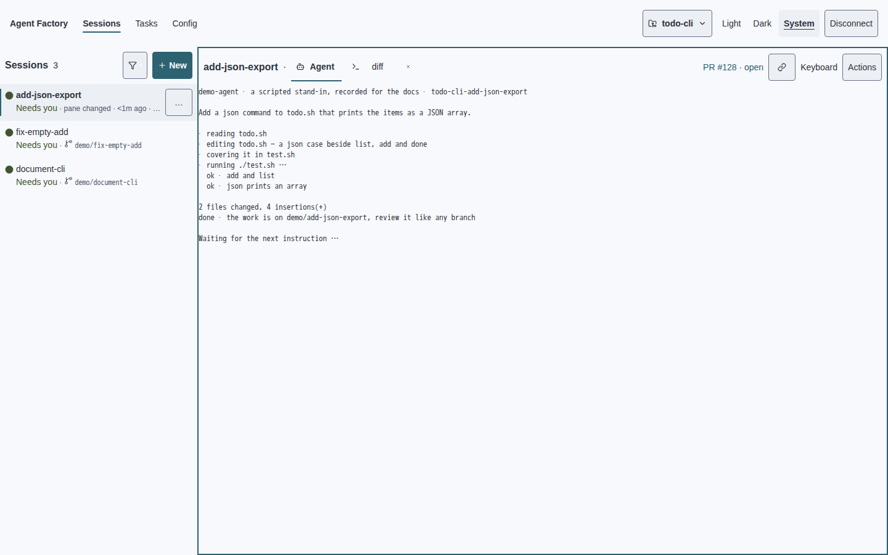

# Beauty is a clear place to work

Phase 1 of [#4065](https://github.com/sachiniyer/agent-factory/issues/4065).
Web is the primary surface. This extends the [interface contract](interface-design.md)
and its generated [style guide](style-guide.md); it is not a new theme system.
Sachin reviews this thesis for taste before Phase 2 begins.

Our interface should feel like a quiet workbench: identify the work, see what
needs attention, read the output, act. Polish comes from making those four things
obvious at every size. The benchmark is **calm surfaces, one accent, hierarchy by
weight and space, a tight consistent rhythm, and no outlined controls at rest**.
These are the qualities meant here by Orca-class polish, not claims about Orca's
implementation and not a proposal to copy its screens.

## Critique before principles

Baseline: `origin/master` at `1ed491b121931ad09a8c4185179b515e935d5217`,
September 8, 2026. The linked images are frozen copies of the container visual
fixtures, read in both themes. Browser fixtures use scripted agent stand-ins;
TUI fixtures run real app-model Update/View with a pinned clock, not live agents.
Desktop is 1440×900; the existing phone gallery is 375×812. The exemplar below
adds exact 360×812 and 80×24 before/after evidence. Light and dark dashboard
fixtures intentionally contain three and four sessions respectively: the first
pass creates the fourth session. Compare within a theme, not counts across themes.

| Current screen · evidence | What is present, and what fails | What the benchmark would do |
| --- | --- | --- |
| Dashboard · [Light](../assets/design/4065/before/dashboard.png) · [Dark](../assets/design/4065/before/dashboard-dark.png) · [Phone light](../assets/design/4065/before/phone-session-first.png) · [Phone dark](../assets/design/4065/before/phone-session-first-dark.png) | Brand, selected view, rail heading, selected name and pane title all use bold ink in two stacked header rows. Project, Disconnect, Filter, row actions, link and Actions each have a resting outline. The selected detail ends in “pane changed · <1m ago · …”. On phone the two top controls and six keybar controls repeat those boxes. | Let the session title lead the pane; give controls quiet filled hit areas and reserve the accent outline for keyboard ownership. Preserve the excellent session-first phone composition. |
| New session · [Light](../assets/design/4065/before/new-session.png) · [Dark](../assets/design/4065/before/new-session-dark.png) · [Phone light](../assets/design/4065/before/phone-create.png) · [Phone dark](../assets/design/4065/before/phone-create-dark.png) | Defaults are already disclosed and Create is already the one filled action. But the outer frame, four field outlines and defaults outline nest six rectangles. Title, Project and Account have similar vertical prominence to Prompt. Phone wraps the defaults summary into two lines. | Preserve account visibility and defaults disclosure. Group purpose/input first, inherited context second; separate controls by fill and spacing instead of boxing every field. |
| Agent tab · [Light](../assets/design/4065/before/agent-tab.png) · [Dark](../assets/design/4065/before/agent-tab-dark.png) · phone uses the dashboard's focused Agent terminal above | The transcript has room and uses the correct terminal-owned monospace. The bold “Agent” label competes with “tidy-tests”; the outer accent rectangle is the largest coloured object. Link and Actions have the same outlined weight despite unequal importance. | Give session identity the largest chrome type; tab identity remains body type. Keep the terminal's own font and bytes. A focus edge is functional; extra control edges are not. |
| Tasks · [Light](../assets/design/4065/before/tasks.png) · [Dark](../assets/design/4065/before/tasks-dark.png) · [Phone light](../assets/design/4065/before/phone-tasks.png) · [Phone dark](../assets/design/4065/before/phone-tasks-dark.png) | Task names and next runs now lead; Remove is correctly behind Actions. At desktop the paired outlined Edit/Actions controls sit at the far right, detached from names at the far left. Phone brings them together, but the control grid remains the strongest repeating shape. | Keep the improved action disclosure. Bound the reading width and group each task with its actions; use one action hierarchy rather than two equally outlined buttons. |
| Config/accounts · [Light](../assets/design/4065/before/config-accounts.png) · [Dark](../assets/design/4065/before/config-accounts-dark.png) · [Phone light](../assets/design/4065/before/phone-config.png) · [Phone dark](../assets/design/4065/before/phone-config-dark.png) | The desktop control column is far from its labels. The Accounts explanation crosses almost the whole screen; on phone it becomes a dense paragraph above identities. Paths use the 12px caption step. Disabled Save has a dashed rectangle, more texture than an ordinary value. | Bound prose width; pair key and value locally; show identity/login state before implementation explanation. Keep full actionable paths available and readable. |
| TUI Sessions/preview · [Light](../assets/design/4065/before/tui-sessions-dense-light.svg) · [Dark](../assets/design/4065/before/tui-sessions-dense-dark.svg) · [Preview light](../assets/design/4065/before/tui-preview-light.svg) · [Preview dark](../assets/design/4065/before/tui-preview-dark.svg) | Empty Automations/Projects no longer consume sections. Selected rows have a raised surface, but the selected session name has no stronger weight than its siblings. The preview title's raised chip stops after the text rather than defining a whole header plane. The frame-state regression also shows that a selected-but-unfocused pane receives an accent border even though input belongs elsewhere (`TestTabbedWindowFrameStyleUsesPaneBorderThemeSlots`). | Bold the selected work, fill one complete header row and reserve the pane accent for keyboard ownership. Keep the word preview and existing help route to origin. |
| TUI Tasks · [Light](../assets/design/4065/before/tui-tasks-light.svg) · [Dark](../assets/design/4065/before/tui-tasks-dark.svg) | The selected task correctly expands and warnings no longer mean selection. Its four detail lines have similar muted weight, while footer shortcut fragments sit on small contrasting strips. The large background empty-pane frame remains visible around the overlay. | Group next run with task identity; disclose secondary scheduling/delivery data; treat the overlay as one plane and keep its exit instructions readable. This is Phase 2. |

### Five named failures

1. **Outline multiplication.** Dashboard light has six secondary control boxes
   before counting tabs, the pane frame or New. The phone repeats eight boxes
   around two header and six keybar controls. New session nests field and
   disclosure outlines inside the dialog frame. Edges describe controls more
   loudly than the work they operate on.
2. **Equal-weight chrome.** On the dashboard, brand, Sessions, rail heading,
   selected name and pane identity all demand a bold read. In the agent still,
   “Agent” is as prominent as the session identity. The TUI preview uses a small
   highlighted text chip rather than a coherent header plane.
3. **Small type carrying too much.** Branch/time/path metadata is 12px; the
   selected web row concatenates state, mechanical reason, age and branch into
   one clipped line. Config's daemon/path line and phone Accounts prose show
   the same failure at different densities. Smaller letters do not solve an
   information-order problem.
4. **Spacing without relationships.** Tasks leaves nearly a screen width
   between name and action. Config separates labels and fields similarly, yet
   its explanation spans the entire width. Rail names start 26px from the edge
   while section headings start at 8px. The many locally calculated gaps have
   no visible grouping rule. Whitespace is abundant but does not consistently
   connect related information.
5. **Too many attention cues.** The dashboard combines the accent pane frame,
   active-view and tab underlines, New fill and selected-row marker with ready
   green labels/dots. These are two intentional hue families, not an invented
   rainbow problem. The TUI dense list adds necessary lost/dead semantics;
   colouring another selected pane edge spends attention without adding state.
   Shape and labels must keep semantic warnings readable without making every
   control an attention signal.

Iconography is already substantially consistent: web uses Lucide, TUI uses
terminal glyphs, and Working has no animated indicator. Keep that success;
do not replace the terminal's glyph vocabulary with emoji or recolour agent
output to match chrome. Branch icons plus several separators increase the
selected detail's width; remove repetition before shrinking an icon.

The normal-state stills cannot prove loading or error behaviour. The separate
[web recovery matrix](recovery-stills.md) and [TUI recovery matrix](tui-recovery-stills.md)
remain the contract: one condition, consequence and next action, preserved input,
static loading text and full actionable errors. A failed save must not look like
empty data. Phase 2 includes explicit recovery captures rather than inferring
recovery quality from a successful dashboard. No animation is introduced.

## Seven principles that decide cases

| Principle | Mechanical rule | Counter-example in our evidence |
| --- | --- | --- |
| 1. Work has the strongest voice | In a populated pane, session identity is the largest chrome type; active work gets 600 weight. Navigation and tab labels remain body size. TUI uses bold selected identity, never larger cell art. | Dashboard brand/view/pane peers; unbold selected TUI session. |
| 2. One accent, one ownership story | Accent is for the primary action, selection marker and actual keyboard focus. A selected pane without input gets neutral border. State colours stay confined to their fixed glyph/label; never colour an entire name. Keep explicit Keyboard/preview words. | TUI selected-but-unfocused accent frame and web's collection of competing accent marks. |
| 3. Planes have edges; resting controls have fills | Secondary controls use raised fill and ink with a transparent resting border. Keep their hit box; keyboard focus still draws the 2px accent outline. Borders delimit panes, menus and dialogs; disabled dashed boundaries remain an accessibility exception until their own reviewed slice. | Dashboard's six boxes and phone's eight; modal's nested frames. |
| 4. Space must show a relationship | Use 4/8/12/16/24/32px only for decorative spacing: 4 glyph gap, 8 related controls, 12 compact row inset, 16 panel inset, 24 groups, 32 major sections. TUI uses 1/2 horizontal cells and one blank row. Geometry, 1px borders and 44px touch targets are not spacing. Align section and row starting edges. | Rail heading at 8px versus name at 26px; task and config actions at the opposite edge of the viewport. |
| 5. Read before compressing | Web chrome floor is 13px, body/actions 14px, pane heading 20px. Muted ink is metadata only and keeps the current contrast floors. Truncate an identity with a full-title route; never hide failure or a path needed for recovery. | 12px metadata and the selected row's clipped reason/age/branch chain. |
| 6. Density follows the current job | Preserve one name line plus one useful summary on web; expand only selected details on TUI. At ≤768px the session owns the screen: 48px header, 44px keybar, overlay drawer, ≥85% terminal with keyboard closed. Preserve terminal nodes and dimensions while menus open. | Config's long implementation paragraph on phone; TUI Tasks' four equal secondary lines. The session-first phone screenshot is the positive example. |
| 7. A state is a sentence, not decoration | Keep sentence case, `…`, ` · ` fragments and `—` clauses. Every state has a label; errors give a next action, loading stays motionless, empty states offer one action. Icon vocabulary stays Lucide on web and fixed glyphs on TUI. | The selected web row says “pane changed” without enough space to explain why it matters; TUI footer cues compete with preview identity. |

## Concrete token consequences

The palette stays exactly fixed: twelve roles and the existing Light/Dark/System
choice. In particular Dark Modern keeps `surface #1f1f1f`, `surface-raised #2b2b2b`,
`border #3d3d3d`, `ink #cccccc` and `accent #2296f3`. No new surface, shadow,
selection, hover, preview or custom colour is added. Ready/lost/dead semantics
and agent ANSI bytes are untouched.

| Source decision | Phase 1 consequence | Phase 2 application |
| --- | --- | --- |
| `type-caption: 0.75rem → 0.8125rem` | 13px floor for inherited chrome metadata, generated from `design/tokens.json`. This intentionally changes metadata on other screens too; their layouts/interaction designs are not redesigned here. | Audit all dense tables, paths and recovery fixtures at the same floor. |
| Retain body 14, heading 16, title 20, display 24 | Dashboard session identity consumes the existing title step on desktop; phone retains heading so its header stays 48px. No sixth font step or webfont. | Apply the hierarchy per screen, not a global “make headings larger” selector. |
| Retain space tokens 4/8/16/24 | 12 = space-1 + space-2; 32 = 2 × space-3. Reuse named source steps rather than enlarging the 23-token contract. Dashboard rows use 12px vertical rhythm and aligned 16px side insets. | Replace arbitrary decorative combinations with the six allowed results. |
| Retain radii 4/8 | 4px controls, 8px dialogs/menus; no cards, pills or radius tokens added to the terminal. | Remove local exceptions when each component is reviewed. |
| Clarify `border` and `surface-raised` roles | Secondary dashboard controls retain transparent border geometry and raised fill. Pane boundaries remain neutral except actual keyboard ownership. TUI selected pane uses neutral frame and a complete raised header row. | Migrate form fields and remaining controls in their slices. |
| Keep muted ink values and contrast floors | Readability improves through type and use, not a third grey. Body ≥7:1 on surface; metadata/state ≥4.5:1 on both planes; ink/muted separation ≥1.5:1. Dark borders retain #3971's 1.5:1 surface floor. | Enforce roles in recovery/details instead of dimming action labels. |

`design/style-guide.tmpl` and `internal/designtokens` describe these consequences;
`scripts/gen-docs.sh` generates CSS, Go/lipgloss tokens and documentation together.
Generated files are never edited directly. The current component specimens remain
useful for Phase 2; the exemplar below is the authority for the revised sessions
recipe until those specimens are refreshed with their owning slice.

## Exemplar and evidence

Only the dashboard/focused-session composition and TUI sessions/preview receive
component changes. Shared caption sizing is the explicit source-token cascade.
No transport, focus transfer, phone key handling or session lifecycle changes.
The live browser and pinned app-model captures are committed alongside this page;
[capture provenance and source hashes](../assets/design/4065/captures.json) identify
the exact fixtures and runs.
The TUI SVGs are source captures; their PNG twins are CairoSVG rasterizations for
inline review. The wider matrix was recaptured too: 28 existing stills change,
principally selected-name weight and full-width pane headers. Every changed still
was read; layout, warnings, task dates and terminal content remain intact.

| Surface | Before | After | Pixel reading |
| --- | --- | --- | --- |
| Desktop · Light · 1440×900 | [Before](../assets/design/4065/before/dashboard.png) | [After](../assets/design/4065/after/dashboard.png) | Filled controls, stronger session identity and more deliberate rail spacing. |
| Desktop · Dark · 1440×900 | [Before](../assets/design/4065/before/dashboard-dark.png) | [After](../assets/design/4065/after/dashboard-dark.png) | Same hierarchy on the unchanged neutral Dark Modern surfaces. |
| Phone · Light · 360×812 | [Before](../assets/design/4065/before/phone-360.png) | [After](../assets/design/4065/after/phone-360.png) | Header/keybar edges quieten; 48px header and 44px targets remain. |
| Phone · Dark · 360×812 | [Before](../assets/design/4065/before/phone-360-dark.png) | [After](../assets/design/4065/after/phone-360-dark.png) | One accent focus frame; labels stay ink on filled controls. |
| TUI Sessions · Light · 80×24 | [Before](../assets/design/4065/before/tui-sessions-80-light.png) | [After](../assets/design/4065/after/tui-sessions-80-light.png) | Selected name is bold; the raised header continues to the right plane edge. |
| TUI Sessions · Dark · 80×24 | [Before](../assets/design/4065/before/tui-sessions-80-dark.png) | [After](../assets/design/4065/after/tui-sessions-80-dark.png) | Neutral frame stays quiet; title weight separates work from context. |
| TUI Preview · Light · 80×24 | [Before](../assets/design/4065/before/tui-preview-80-light.png) | [After](../assets/design/4065/after/tui-preview-80-light.png) | Preview remains fully visible on one header row; both output lines are unchanged. |
| TUI Preview · Dark · 80×24 | [Before](../assets/design/4065/before/tui-preview-80-dark.png) | [After](../assets/design/4065/after/tui-preview-80-dark.png) | The former short title chip becomes a complete raised header plane. |

The retained pane boundary is functional keyboard focus, not decorative framing.
Terminal font, transcript and focus-ring inset remain unchanged. The desktop
Sessions header is 16px shorter in both its empty and populated states, so opening
a terminal does not shift the rail. Four empty-session recovery goldens inherit
that 16px of extra content height; their centered condition and single action are
unchanged. This is the stable Sessions frame, not a recovery redesign.

Visual goldens are intentionally regenerated for caption sizing, control fills,
session spacing and TUI header/name weight. The visual tolerance stays zero
differing pixels at the existing 0.2 threshold, and performance budgets are
unchanged. The initial conditional-spacing attempt failed the load-shift budget;
the final spacing is established by the existing Sessions view class before
terminal attachment. Phase 2 still
owns the full selected-row reason disclosure and the broader form redesign.

## Phase 2 · one reviewed slice per PR

Taste approval by Sachin is the first dependency. Then let the open web work land
before starting these slices or regenerating its dist. The September 8 queue
includes #4033 (button clarity/copy), #4047 (rail prefixes), #4043 (keybar modifiers),
#4042 (web-tab proxy), #4028 (root delivery), #4027 (account handoff), #4023 (restore),
#4022 (tab picker) and #4020 (PR-state removal). Recheck the queue at slice start;
this is a dependency inventory, not a request to delay their fixes. Each slice
rebases after its predecessor and regenerates dist once to avoid cascade conflicts.

1. **Web session details and remaining chrome.** Resolve the clipped reason chain,
   preserve full branch/recovery detail, reconcile #4033 and #4020, then apply
   the exemplar to tab menus, splits and project/filter disclosures. Goldens:
   desktop and 360/390/430, both themes, selected/lost/limit/failure and keyboard
   ownership. No tab-transport rewrite.
2. **Web creation and confirmations.** Group prompt/purpose and inherited context;
   apply filled fields with clear focus and target-specific destructive actions.
   Goldens: compact/expanded defaults, account ambiguity, failed create and
   confirmation in both themes at desktop and 360px. Preserve entered values.
3. **Web Tasks.** Bound reading width, bring action to task, distinguish next run
   from schedule detail. Goldens: empty/populated, cron/watch, overdue/failure,
   edit/delete, desktop/phone. Preserve no run-now action for watches.
4. **Web Config and accounts.** Pair fields with purpose, bound prose, place account
   identity/login state ahead of explanation. Goldens: clean/dirty/failed save,
   login/registration/assistant failure, long paths, desktop/phone.
5. **Web recovery and accessibility finish.** Apply the hierarchy to every empty,
   loading, disconnected and failed-operation state; audit focus return and
   keyboard-only routes. Re-run the full recovery matrix and all phone budgets.
6. **TUI Tasks.** Group task identity and next run, then scheduling/delivery
   details. One PR with 80×24 and 120×36 light/dark goldens for selection, cron,
   watch, failure and task actions; preserve all keyboard routes.
7. **TUI Config and accounts.** Apply the accepted hierarchy to keys, values,
   account identity and full actionable paths. One PR with both sizes/themes,
   dirty state, failed save and login/registration evidence.
8. **TUI overlays, help and footer.** Unify the remaining plane and shortcut
   treatments in one PR. Capture help, search, pickers and confirmations at both
   sizes/themes; preserve preview origin disclosure and explicit keyboard owner.
9. **Docs and public stills.** After the product slices land, refresh the generated
   specimen recipes, style-guide gallery, docs/public stills and recorder media.
   Preserve stand-in provenance; do not publish a mockup as the running product.

Every slice keeps motionless states, full web selftest/unit/typecheck/build,
performance budgets, exact visual goldens, design drift and strict MkDocs green;
TUI slices also run the container ui/app suite. A budget change needs measurements
and an explicit reason. Phase 1 is **Part of #4065**, not closure of the program.
