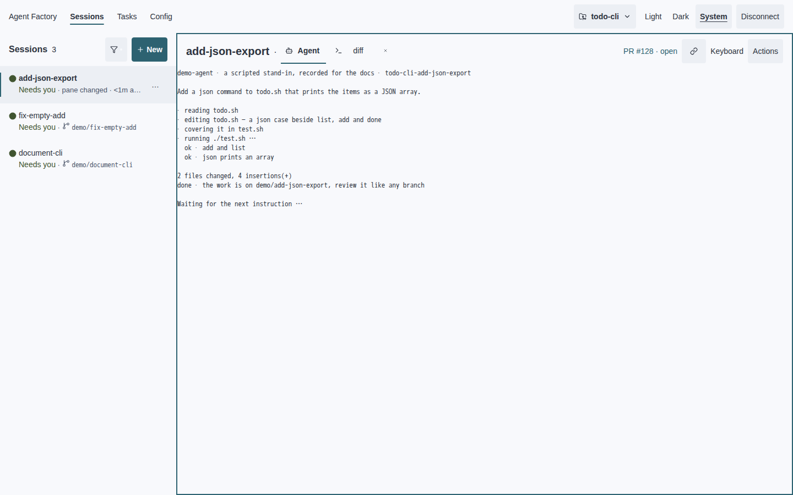
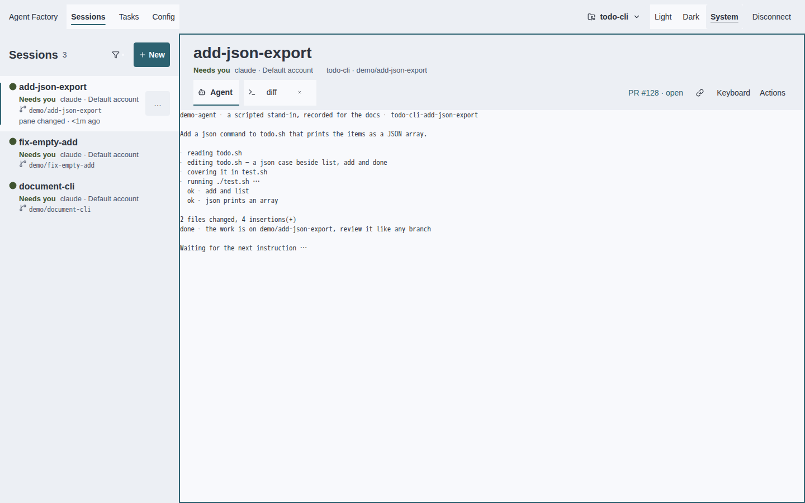

# Beauty thesis · let the web express the work

Sachin's taste review resets the scope of #4065: “I think the TUI looks pretty
clean right now. I think that it is pretty tasteful and minimal and expressive
in the ways that it should be. I think the web UI is not as expressive as it
could be though.” The TUI is the accepted in-house benchmark: **expressive with
few means**. It is not a second redesign target.

The web needs more character through information, not decoration. At thumbnail
size a focused session should already have an identity and a working surface;
at reading size the fleet should say who is doing what and what needs me.
Merely removing borders and enlarging a name from 16 to 20px was insufficient.
This revision replaces that conservative posture with a visible hierarchy.

## Critique with evidence

The original review set below is frozen at `1ed491b1`. The immediate comparison
for this revision is the four [0a47c3f0 captures](../assets/design/4065/revision-before/dashboard.png),
not an invented mockup. Both sets come from the real container browser with
scripted stand-in agents. The agent output is not product chrome.

| Screen and evidence | What the web currently expresses | What it should express |
| --- | --- | --- |
| Dashboard · [Light](../assets/design/4065/before/dashboard.png) · [Dark](../assets/design/4065/before/dashboard-dark.png) · [Phone light](../assets/design/4065/before/phone-session-first.png) · [Phone dark](../assets/design/4065/before/phone-session-first-dark.png) | Brand, selected view, rail heading, selected name and pane title all use bold ink in two stacked header rows. Project, Disconnect, Filter, row actions, link and Actions each have a resting outline. The selected detail ends in “pane changed · <1m ago · …”. On phone the two top controls and six keybar controls repeat those boxes. | Let the session title lead the pane; give controls quiet filled hit areas and reserve the accent outline for keyboard ownership. Preserve the excellent session-first phone composition. |
| New session · [Light](../assets/design/4065/before/new-session.png) · [Dark](../assets/design/4065/before/new-session-dark.png) · [Phone light](../assets/design/4065/before/phone-create.png) · [Phone dark](../assets/design/4065/before/phone-create-dark.png) | Defaults are already disclosed and Create is already the one filled action. But the outer frame, four field outlines and defaults outline nest six rectangles. Title, Project and Account have similar vertical prominence to Prompt. Phone wraps the defaults summary into two lines. | Preserve account visibility and defaults disclosure. Group purpose/input first, inherited context second; separate controls by fill and spacing instead of boxing every field. |
| Agent tab · [Light](../assets/design/4065/before/agent-tab.png) · [Dark](../assets/design/4065/before/agent-tab-dark.png) · phone uses the dashboard's focused Agent terminal above | The transcript has room and uses the correct terminal-owned monospace. The bold “Agent” label competes with “tidy-tests”; the outer accent rectangle is the largest coloured object. Link and Actions have the same outlined weight despite unequal importance. | Give session identity the largest chrome type; tab identity remains body type. Keep the terminal's own font and bytes. A focus edge is functional; extra control edges are not. |
| Tasks · [Light](../assets/design/4065/before/tasks.png) · [Dark](../assets/design/4065/before/tasks-dark.png) · [Phone light](../assets/design/4065/before/phone-tasks.png) · [Phone dark](../assets/design/4065/before/phone-tasks-dark.png) | Task names and next runs now lead; Remove is correctly behind Actions. At desktop the paired outlined Edit/Actions controls sit at the far right, detached from names at the far left. Phone brings them together, but the control grid remains the strongest repeating shape. | Keep the improved action disclosure. Bound the reading width and group each task with its actions; use one action hierarchy rather than two equally outlined buttons. |
| Config/accounts · [Light](../assets/design/4065/before/config-accounts.png) · [Dark](../assets/design/4065/before/config-accounts-dark.png) · [Phone light](../assets/design/4065/before/phone-config.png) · [Phone dark](../assets/design/4065/before/phone-config-dark.png) | The desktop control column is far from its labels. The Accounts explanation crosses almost the whole screen; on phone it becomes a dense paragraph above identities. Paths use the 12px caption step. Disabled Save has a dashed rectangle, more texture than an ordinary value. | Bound prose width; pair key and value locally; show identity/login state before implementation explanation. Keep full actionable paths available and readable. |

### The reference we already own

The [TUI fleet, light](../assets/design/4065/before/tui-sessions-dense-light.svg)
and [dark](../assets/design/4065/before/tui-sessions-dense-dark.svg) use a tree,
aligned state glyphs, short names and selective disclosure to make a fleet
readable. The [preview](../assets/design/4065/before/tui-preview-dark.svg) names
its relationship to the origin without dressing up the transcript. The
[Tasks view](../assets/design/4065/before/tui-tasks-light.svg) expands the selected
work while preserving the surrounding list. These are positive references,
not counterexamples to “fix”. No TUI style or golden changes remain relative
to the integrated master. Shared token changes affect CSS values and role
prose only; generated Go paint and terminal cell values are unchanged.
The [equality manifest](../assets/design/4065/tui-unchanged.json) records all 100
container SVG captures: every byte matches master `bb6d6179`.

### Five failures of web expression

1. **State without a glance.** The state word competes with a clipped mechanical
   reason, timestamp and branch. A fleet of names is not yet a fleet of states.
   The TUI's aligned glyphs and selected disclosure establish the useful model.
2. **Identity without an owner.** The dashboard says “tidy-tests” and “Agent” but
   omits the projected agent and account. A session name is not enough to decide
   whose work one is about to address. Never infer an owner from the viewer.
3. **Work without a place.** Repo context sits remotely in the app bar; branch is
   buried in a secondary rail line. The focused surface does not say where its
   work lives. Diff/change scope belongs with that context once authoritative
   data is available, not as a fabricated “0 changes” badge.
4. **Attention without priority.** Boxes and equally weighted controls dominate
   the same space as Needs you, Broken and Waiting on a limit. Those state words
   should be more legible than a resting Actions button. Working needs no dot or
   animation; colour and literal words must tell the same story.
5. **A focused session without a face.** Brand, navigation, tab and session title
   were near-peers. In `0a47c3f0` a 20px title in the same narrow strip still does
   not establish a clear destination. The terminal, rail and header share one
   plane, so the work has no visual separation from its controls.

The wider web critique remains relevant: New session outlines every field;
Tasks separates labels from their actions across the viewport; Config lets
implementation prose outrank account identity. These are sequenced follow-ups,
not justification for repainting the TUI. Recovery must still explain condition,
consequence and next action, preserve entered input and avoid false empty states.
See the [web recovery matrix](recovery-stills.md).

## Seven principles that decide web cases

| Principle | Mechanical decision | Our counterexample |
| --- | --- | --- |
| 1. Give the session a face | 28px/600 focused desktop title, 20px fleet heading, 16px row identity, 13px metadata. Navigation remains 14px. At 360px keep a 16px title above a compact identity line inside the existing 48px header. | The old dashboard's near-equal brand, title and Agent label. |
| 2. Show the person and agent behind the name | Use the daemon's current agent and account in every fleet row and the focused header. An absent account means Default account; an absent agent says Agent not reported. Never claim that an ambient identity is the viewer. | The old rail's title plus branch cannot distinguish two accounts running the same task. |
| 3. Colour carries state, accent carries interaction | One accent for focus/selection/primary action. Existing ready/lost/dead/limit colours support literal state labels, not decorative names or coloured cards. Working stays motionless and has no glyph. | Resting outlined controls competed with the old clipped Needs you line. |
| 4. Separate the work from its chrome | Use the existing raised surface for web navigation and the identity header, and the base surface for the terminal and selected row. No gradients, new hues, shadows or animated elevation. | The earlier same-plane dashboard could only distinguish regions with outlines. |
| 5. A fleet is a list, not a stack of cards | Repeat compact aligned rows: name, agent/account, state and branch. Use 8px vertical row inset, 16px horizontal inset; selected mechanical detail can expand. Preserve the stable row/action hit areas and full identity routes. | The old two-line row clipped different facts into one line; increasing its padding did not increase understanding. |
| 6. Put the work's address next to its identity | The focused desktop header shows repo and branch with full paths in its title disclosure. Do not invent diff metrics absent from the projection. Phone keeps identity/state on screen and the fleet in its drawer. | A repo selector at the opposite corner and clipped branch do not identify the focused work. |
| 7. Protect the working session | No animation (#1766), sentence case, visible keyboard ownership, 44px phone controls and the session-first layout. Preserve terminal nodes across identity updates. Errors give a next action; unknown facts stay unknown. | Adding another permanent mobile toolbar would reduce the terminal instead of improving its identity. |

## Concrete source-token consequences

The two palettes remain fixed. Dark keeps Dark Modern near-black neutrals:
`surface #1f1f1f`, `surface-raised #2b2b2b`, `border #3d3d3d`, `ink #cccccc`,
`accent #2296f3`. Meaningful state colours are the existing state roles, not a
second accent. All terminal colour, spacing and weight outputs remain master.

| Source decision | Web consequence | TUI consequence |
| --- | --- | --- |
| Caption CSS 12 → 13px | Readable owner/branch/state metadata; inherited on other web screens, whose goldens are reviewed. | None: one terminal row remains one row. |
| Display CSS 24 → 28px | Focused session identity has twice the body-size scale; existing empty headings inherit the step. | None: unchanged cell value and generated styles. |
| Retain title 20, heading 16, body 14 | Fleet section, row identity and controls have different jobs and weights. | None. |
| Clarify base/raised surface roles | Navigation and identity sit above the terminal through two existing fills. Selected work connects visually to the terminal. | No remapping of TUI surfaces. |
| Retain all twelve colours | State labels use ready/lost/dead/limit semantics; one accent retains interaction ownership. | Exact existing palette and bindings. |
| Retain 4/8/16/24 spacing and 4/8 radii | Compact fleet rhythm; 24px desktop identity inset; no decorative cards or outlined controls at rest. | Exact existing values. |

`design/tokens.json` and `design/style-guide.tmpl` are the sources.
`scripts/gen-docs.sh` regenerates CSS and documentation. The generator's earlier
Pane/PaneHeader additions have been removed; `ui/`, `app/` and generated Go theme
must have zero diff from master. Contrast floors and performance/visual budgets
are unchanged. The desktop header geometry contract changes from a single row
under 64px to two rows under 144px: the extra space carries identity and work
context. Phone remains 48px with at least 85% terminal coverage. The web cannot purchase expressiveness by repainting agent ANSI.

## Exemplar and capture reading

The exemplar is **web dashboard with rail and focused session only**. The
comparison starts at `0a47c3f0`, the rejected conservative web pass. The
[capture manifest](../assets/design/4065/captures.json) records both revisions
and the no-change TUI proof. Every regenerated web golden is read, including
inherited caption/display changes in other views; a clipped control or missing
state is a defect, not a new baseline.

| Surface | Before · 0a47c3f0 | After | Reading |
| --- | --- | --- | --- |
| Desktop light · 1440×900 | [Before](../assets/design/4065/revision-before/dashboard.png) | [After](../assets/design/4065/after/dashboard.png) | The large session name and raised identity plane establish a destination; the rail names agents/accounts alongside the fleet. |
| Desktop dark · 1440×900 | [Before](../assets/design/4065/revision-before/dashboard-dark.png) | [After](../assets/design/4065/after/dashboard-dark.png) | The same hierarchy uses only the existing near-black neutral surfaces and semantic state colours. |
| Phone light · 360×812 | [Before](../assets/design/4065/revision-before/phone-360.png) | [After](../assets/design/4065/after/phone-360.png) | Identity/state join the title within the existing header, without an extra toolbar or loss of the session-first composition. |
| Phone dark · 360×812 | [Before](../assets/design/4065/revision-before/phone-360-dark.png) | [After](../assets/design/4065/after/phone-360-dark.png) | Raised chrome separates the compact identity from the terminal; keyboard ownership remains explicit. |

## Phase 2 · web slices, one reviewed PR each

Sachin's taste review is the dependency. This PR stays draft; Phase 1 is Part of
#4065, not closure. Recheck current web work before each slice and integrate it
before regenerating dist. No TUI redesign slice is queued by this thesis.

1. **Work context and change scope.** Bring authoritative diff/change information
   beside repo/branch and expose full context on phone. Audit long identities,
   multiple accounts and remote/unknown agents. Never imply a clean worktree
   when no diff was measured. Capture desktop and 360/390/430 in both themes.
2. **Fleet attention and detail disclosure.** Make selected reasons and recovery
   actions readable in dense real fleets, including lost, broken, limit and
   delivery uncertainty. Preserve ordering, filters and literal projected state.
3. **Creation and confirmations.** Give purpose and owner precedence over inherited
   defaults; group fields without nested boxes. Capture account ambiguity,
   failed create and destructive confirmations; preserve typed input.
4. **Tasks.** Pair identity with next run and actions; distinguish schedule details
   from what needs attention. Capture cron/watch, empty, overdue and failure.
5. **Config and accounts.** Put identity/login state before explanations, bound
   prose width and pair fields with purpose. Capture dirty/failed saves, long
   paths and login/registration failure on desktop and phone.
6. **Recovery and accessibility.** Apply the hierarchy to every empty, loading,
   disconnected and failed state; audit keyboard routes and focus return.
7. **Documentation and public stills.** Refresh specimen recipes and public media
   only after the corresponding web slices land; keep stand-in provenance.

Every slice keeps full web selftest, unit tests, typecheck/build, performance
budgets, exact reviewed visual goldens, generated-doc drift and strict MkDocs.
The TUI remains the benchmark, with its own existing regression suite unchanged.
