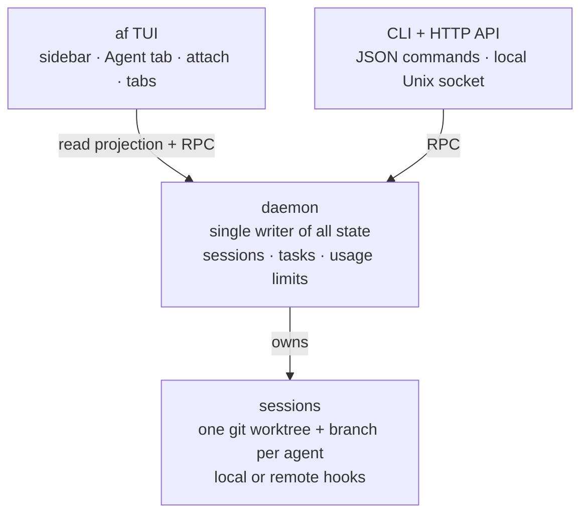

Core workflow

<h2 class="af-section-title">One task, one agent, one reviewable branch</h2>

Agent Factory is built for the moment after "ask an agent" becomes "supervise
several agents." It gives each normal session an isolated git worktree, keeps
the agent running under daemon supervision, and brings every session back to a
normal git review path.

-   :material-source-branch:{ .lg .middle } __Create isolated work__

    ---

    Start a session for a task. Agent Factory creates a branch and git worktree,
    then launches your chosen agent inside it.

    [:octicons-arrow-right-24: Sessions and worktrees](concepts/worktree-agents.md)

-   :material-view-dashboard-outline:{ .lg .middle } __Watch every agent__

    ---

    The TUI shows each session, status, and Agent tab from one terminal. Scan
    progress without attaching to every running process.

    [:octicons-arrow-right-24: The TUI](concepts/tui.md)

-   :material-keyboard-outline:{ .lg .middle } __Jump in when needed__

    ---

    Interact in-pane, attach full-screen, or open helper tabs for shells, dev
    servers, and test watchers in the same worktree.

    [:octicons-arrow-right-24: How it works](how-it-works.md)

-   :material-call-merge:{ .lg .middle } __Review and merge normally__

    ---

    The result is a real branch. Use your existing `git diff`, pull request,
    CI, and merge flow instead of trusting a hidden agent workspace.

    [:octicons-arrow-right-24: Why Agent Factory](why-agent-factory.md)

-   :material-timer-cog-outline:{ .lg .middle } __Automate recurring work__

    ---

    Cron tasks and watch scripts can create sessions or deliver prompts into
    existing ones, hosted by the same daemon that keeps sessions alive.

    [:octicons-arrow-right-24: Tasks and automation](tasks.md)

-   :material-console-network-outline:{ .lg .middle } __Script the control plane__

    ---

    Every session and task operation is available through JSON CLI commands and
    a local owner-only HTTP API over a Unix socket.

    [:octicons-arrow-right-24: CLI guide](cli.md)

## How Agent Factory Fits

Agent Factory is not a chat UI and it is not just tmux with a README. The TUI,
CLI, and HTTP API are thin clients over a daemon that owns all session state,
task schedules, worktree operations, and usage-limit recovery.

That design is what lets you close the TUI, reboot, script a task, or call the
API without splitting the world into different sources of truth.

## Start Here

-   :material-rocket-launch-outline:{ .lg .middle } __Install and try it__

    ---

    Install `af`, create a first worktree-backed session, attach, detach, and
    archive it.

    [:octicons-arrow-right-24: Getting started](getting-started.md)

-   :material-map-outline:{ .lg .middle } __Understand the workflow__

    ---

    Follow the path from prompt to worktree, supervision, interaction, review,
    and cleanup.

    [:octicons-arrow-right-24: How it works](how-it-works.md)

-   :material-compare-horizontal:{ .lg .middle } __Compare alternatives__

    ---

    See where Agent Factory sits relative to Herdr, GUI worktree apps, kanban
    dashboards, Claude Agent View, and plain tmux.

    [:octicons-arrow-right-24: Comparison](comparison.md)

