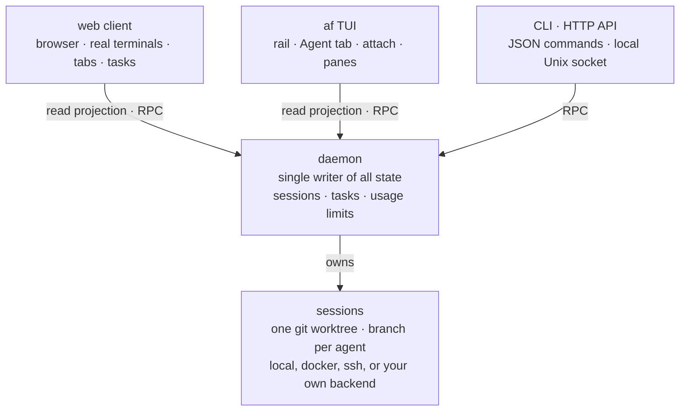

Agent Factory (`af`) runs many AI coding agents — Claude Code, Codex, Aider,
Gemini, Amp, opencode, and Devin — and gives each one its own git branch and git
worktree, so parallel agents never share a checkout and every result comes back
as a branch you review like any other. You drive the whole fleet from a browser,
a terminal UI, or a JSON CLI, and all three read the same state. That state
belongs to a background daemon, which keeps sessions running when you close the
window, schedules recurring work, and serves the web client.

## Install

Prerequisites: **tmux**, **git**, and at least one agent CLI on your `PATH`, on
Linux, macOS, or WSL2.

```bash
curl -fsSL https://raw.githubusercontent.com/sachiniyer/agent-factory/master/install.sh | sh
```

That puts `af` in `~/.local/bin` (override with `AF_INSTALL_DIR`, pin with
`--version <tag>`). Building from source needs Go 1.25+ and `./dev-install.sh`.

## First five minutes

```bash
cd your-project     # any git repo
af doctor --setup   # check tmux, git, agent CLIs, storage, daemon health
af                  # open the TUI
```

Press `n`, name the task, and describe it — the agent starts in a fresh
worktree. Watch it in the Agent tab, press `↵` to type to it in place, `ctrl+]`
to step back out, and `a` to archive it when you are done. Then open
**<http://localhost:8443>**: the same sessions, live, in a browser, with no
token and no login screen.

[Getting started :octicons-arrow-right-24:](getting-started.md){ .md-button .md-button--primary }

## The mental model in five terms

<div class="grid cards" markdown>

-   :material-account-box-outline:{ .lg .middle } __Session__

    ---

    One agent working on one task, with its own tab strip and an explicit
    lifecycle: archive to finish, restore to bring back, kill to discard.

    [:octicons-arrow-right-24: Sessions and worktrees](sessions.md)

-   :material-source-branch:{ .lg .middle } __Worktree__

    ---

    The isolated checkout and branch each session gets, so agents never collide
    and the result is ordinary git work you can diff, push, and merge.

    [:octicons-arrow-right-24: Sessions and worktrees](sessions.md)

-   :material-database-sync-outline:{ .lg .middle } __Daemon__

    ---

    The background process that owns all state, keeps sessions alive across
    restarts, and serves the web client. Every surface is a thin client over it.

    [:octicons-arrow-right-24: The daemon](daemon.md)

-   :material-timer-cog-outline:{ .lg .middle } __Task__

    ---

    A prompt the daemon delivers on its own — on a cron schedule, or on each
    line a watch command prints — into a fresh session or an existing one.

    [:octicons-arrow-right-24: Tasks](tasks.md)

-   :material-key-outline:{ .lg .middle } __Account__

    ---

    A named credential home for an agent, so a session runs as a specific
    Claude, Codex, or Gemini login instead of your ambient one.

    [:octicons-arrow-right-24: Accounts and usage limits](usage-limits.md)

-   :material-map-outline:{ .lg .middle } __All five, expanded__

    ---

    One page with the ideas the rest of these docs assume, and how a prompt
    becomes a branch you can merge.

    [:octicons-arrow-right-24: Concepts](concepts.md)

</div>

## Three surfaces, one daemon

<div class="grid cards" markdown>

-   :material-web:{ .lg .middle } __Web client__

    ---

    Sessions, real terminals, tabs, tasks, and config in a browser — bundled
    into the daemon and on by default at `http://localhost:8443`.

    [:octicons-arrow-right-24: The web client](web.md)

-   :material-console:{ .lg .middle } __TUI__

    ---

    `af` in a git repo: a dense rail of every session, in-place interaction, and
    full-screen attach without leaving the terminal.

    [:octicons-arrow-right-24: The TUI](tui.md)

-   :material-console-network-outline:{ .lg .middle } __CLI__

    ---

    `af sessions` and `af tasks` emit JSON, so scripts — and other agents — can
    create, prompt, watch, and archive sessions.

    [:octicons-arrow-right-24: The CLI](cli.md)

</div>

They cannot disagree, because none of them owns state:


```mermaid
flowchart TB
    web["web client<br/>browser · real terminals · tabs · tasks"]
    tui["af TUI<br/>rail · Agent tab · attach · panes"]
    cli["CLI · HTTP API<br/>JSON commands · local Unix socket"]
    daemon["daemon<br/>single writer of all state<br/>sessions · tasks · usage limits"]
    sessions["sessions<br/>one git worktree · branch per agent<br/>local, docker, ssh, or your own backend"]

    web -->|"read projection · RPC"| daemon
    tui -->|"read projection · RPC"| daemon
    cli -->|"RPC"| daemon
    daemon -->|"owns"| sessions
```

## Beyond your laptop

Sessions can run in a container, on another machine over SSH, or on
infrastructure you provision yourself; the daemon itself can be reached from a
second machine over SSH or an authenticated port.

[Backends and remote access :octicons-arrow-right-24:](backends.md){ .md-button }

## Where to go next

- [Getting started](getting-started.md) — install, first session, first browser tab.
- [Concepts](concepts.md) — the five terms, expanded.
- [Troubleshooting](troubleshooting.md) — `af doctor` and what to file.
- [Why Agent Factory](why-agent-factory.md) · [Use cases](use-cases.md) ·
  [Comparison](comparison.md) — the longer argument, and where this sits next to
  the alternatives.
