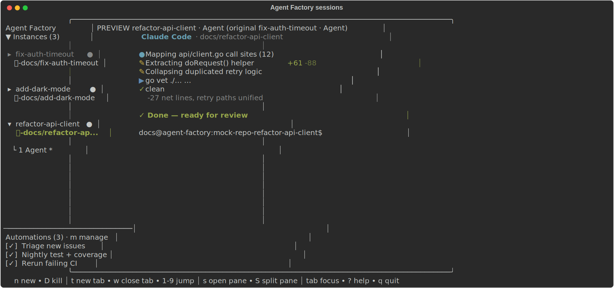
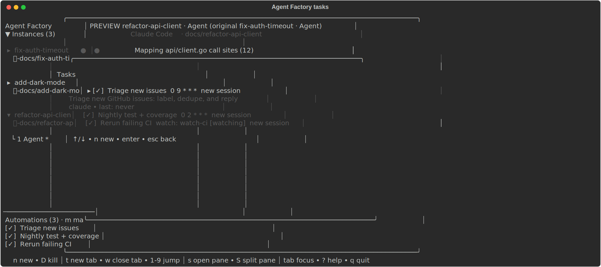

# Use Cases

Agent Factory is useful when you want coding agents to do real repository work
in parallel, but you still want engineering control: isolated files, visible
state, scripted operations, and normal review.

## Parallel Bug Fixes

Give each bug its own session from the TUI. Press **`n`**, name the task, submit
the first session, then repeat for the next bug.

<div class="af-visual-example" markdown>

- `fix-login-loop`
- `fix-webhook-retry`
- `fix-export-timeout`

<figure markdown>

</figure>

</div>

Each agent works in a separate branch and worktree. You can compare the diffs,
run tests independently, and merge only the fixes that hold up.

CLI equivalent:

```bash
af sessions create --name fix-login-loop --prompt "Fix the login redirect loop"
af sessions create --name fix-webhook-retry --prompt "Fix flaky webhook retries"
af sessions create --name fix-export-timeout --prompt "Fix CSV export timeout"
```

## Competing Implementations

For ambiguous work, run multiple approaches at once. Create one session per
approach, then use the sidebar and Agent tab to compare how each attempt is
progressing.

In the TUI, create the attempts as separate named rows:

- `search-sql`: SQL ranking
- `search-index`: index-backed search

Then move between the rows to compare agent progress, notes, and terminal
output before deciding which branch deserves deeper review.

CLI equivalent:

```bash
af sessions create --name search-sql --prompt "Implement search with SQL ranking"
af sessions create --name search-index --prompt "Implement search with an index-backed approach"
```

Because each attempt is isolated, you can evaluate both without untangling
mixed edits in one checkout.

## Review And Follow-Up Loops

Agent work rarely ends at the first answer. Use the TUI to inspect status, press
**Enter** to interact with the selected session, then send the follow-up prompt
in the pane.

CLI equivalent:

```bash
af sessions send-prompt fix-login-loop \
  "The auth middleware test still fails. Reproduce it, fix it, and explain the root cause."
```

The session keeps its branch, worktree, tabs, and terminal context.

## Scheduled Triage

Use the TUI task manager for recurring prompts. Press **`m`**, create a task,
choose the cron trigger, and leave it enabled for the daemon to run.

<div class="af-visual-example" markdown>

- Name: `Daily issue triage`
- Trigger: `0 9 * * 1-5`
- Delivery: create a fresh session or target a persistent triage session

<figure markdown>

</figure>

</div>

Task runs can create fresh sessions or deliver into a persistent triage session.

CLI equivalent:

```bash
af tasks add \
  --name "Daily issue triage" \
  --prompt "Review new issues, group duplicates, and propose next actions" \
  --cron "0 9 * * 1-5"
```

## Event-Driven Intake

Use watch tasks when another system emits work. In the task manager, create a
watch task and point it at the script that emits one event per stdout line.

<div class="af-visual-example" markdown>

- Name: `CI failure watcher`
- Watch command: `./watch-ci-failures.sh`
- Prompt: `Investigate this CI failure: {{line}}`

<figure markdown>

</figure>

</div>

Each stdout line becomes a prompt. The daemon supervises the watcher, logs
stderr, rate-limits noisy sources, and replays queued events after temporary
delivery failures.

CLI equivalent:

```bash
af tasks add \
  --name "CI failure watcher" \
  --watch-cmd "./watch-ci-failures.sh" \
  --prompt "Investigate this CI failure: {{line}}"
```

## Remote Machines

Remote hooks let a repo define scripts for launching, listing, attaching to,
and deleting sessions on another backend. Remote sessions appear in the same
TUI, with the same Agent tab and attach flow.

This is useful when agents need a beefier machine, a specific network, or a
remote development environment while you still want one local control surface.

## Usage-Limit Recovery

Claude and Codex sessions can hit plan usage-limit windows. Agent Factory can
mark those sessions with `[limit]`, preserve task runs as parked instead of
failed, and optionally auto-resume when the reset window elapses.

This is especially useful for unattended task runs: a limit wall becomes a
pause, not a false failure.

## Always-On Root Agent

For repositories where you want a persistent in-place agent, configure a root
agent. The daemon ensures the reserved `root` session is running at the repo
root and can recreate it after process loss.

Use this only for repositories where an autonomous repo-root agent is
intentional and trusted.

## When To Reach For Something Else

Agent Factory is intentionally terminal-native and git-first. Consider another
center of gravity when:

- your team wants a shared kanban board as the primary interface;
- you need a desktop GUI with inline visual diff editing;
- you want a general-purpose terminal multiplexer for all shell workflows;
- you only run one occasional agent and manual worktrees are enough.

See [Comparison](comparison.md) for a deeper map of the tradeoffs.
